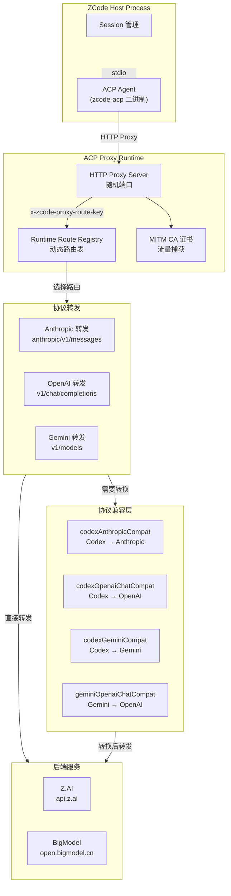
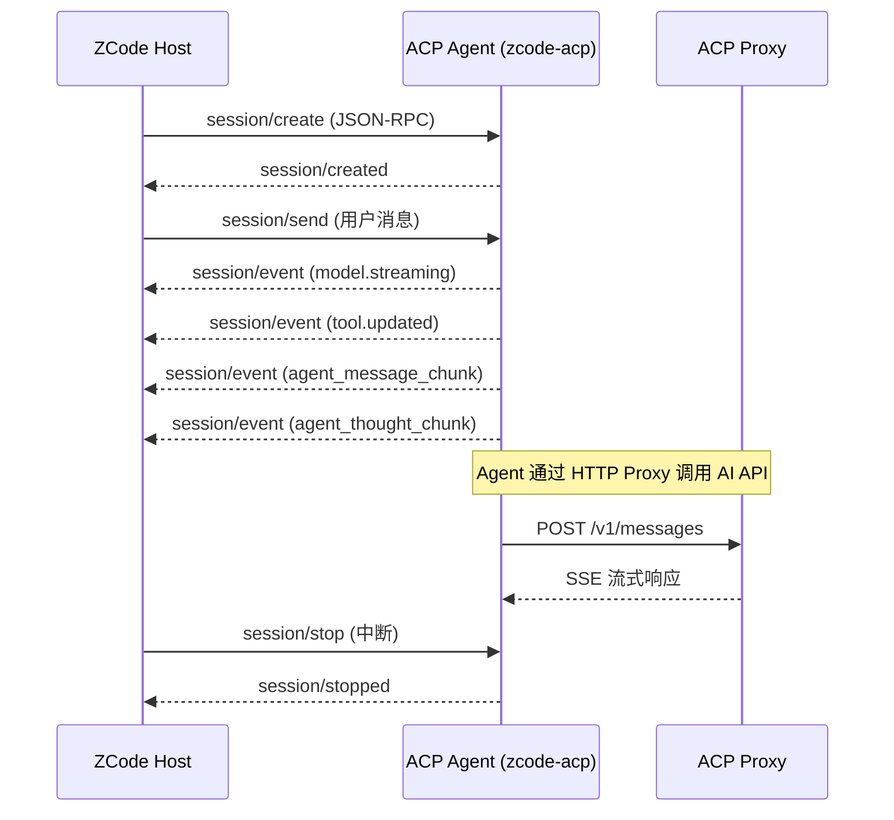
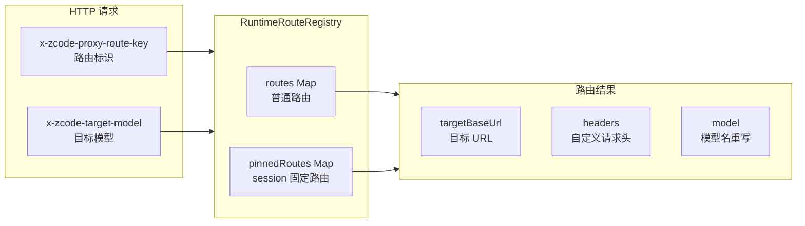
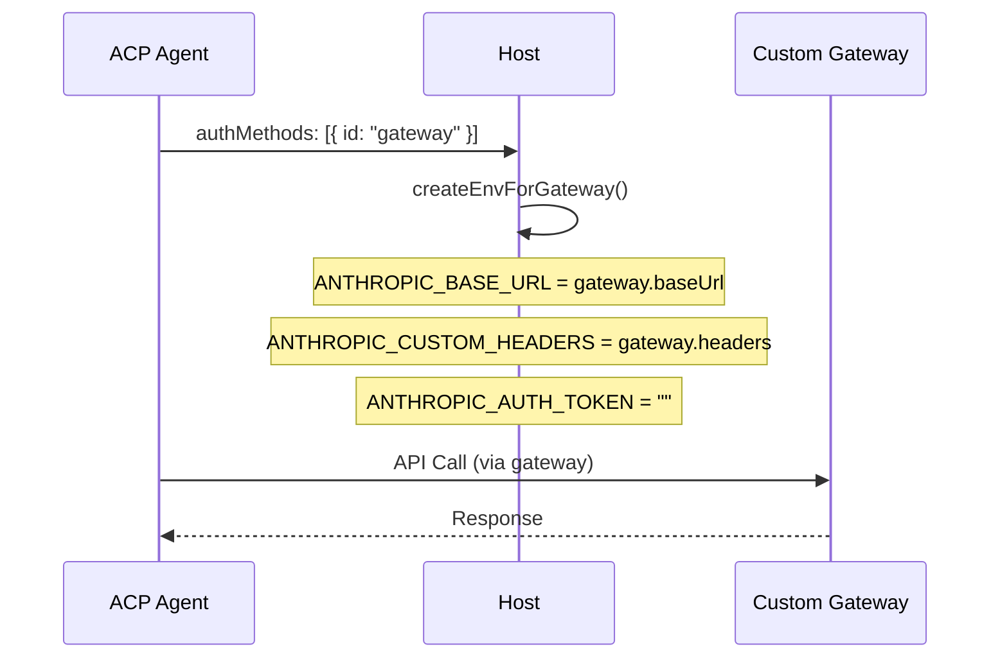
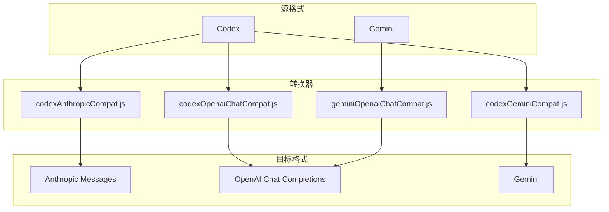
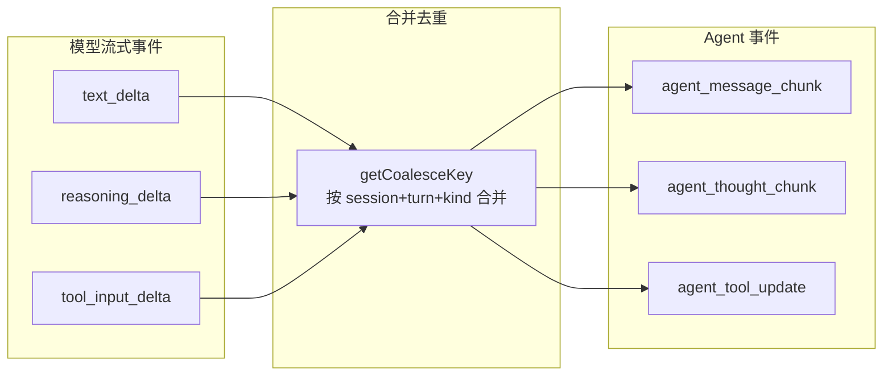

# ACP 代理运行时

> ACP (Agent Communication Protocol) 是 ZCode 的核心代理层，负责 Agent 间通信、HTTP 转发和协议转换。

---

## 架构总览



---

## ACP Agent

ACP Agent (`zcode-acp` 二进制) 负责 LLM Agent 的运行和通信：



### JSON-RPC 协议

```json
{
    "id": 1,
    "method": "session/send",
    "params": { "message": "Hello" },
    "trace": { "traceId": "..." }
}
```

### 支持的 RPC 方法

| 方法 | 方向 | 说明 |
|------|------|------|
| `session/create` | Host → Agent | 创建新会话 |
| `session/resume` | Host → Agent | 恢复历史会话 |
| `session/send` | Host → Agent | 发送用户消息 |
| `session/stop` | Host → Agent | 停止响应 |
| `session/event` | Agent → Host | 流式事件通知 |
| `sessionUpdate` | Host → Agent | Session 更新通知 |
| `workspace/readState` | Host → Agent | 工作区状态读取 |
| `interaction/requestPermission` | Agent → Host | 请求用户授权 |

---

## ACP Proxy Runtime

### 动态路由



### Gateway 认证

当 ACP 客户端支持 Gateway auth 时：



---

## 协议转换



---

## 流式事件管道



### 去重机制

```javascript
function getCoalesceKey(event) {
    if (event.type === "model.streaming") {
        const kind = event.payload.kind;
        return `${event.type}:${sessionId}:${turnId}:${kind}:${inputId}`;
    }
    if (event.type === "tool.updated" && kind === "progress") {
        return `${event.type}:${sessionId}:${toolCallId}`;
    }
}
```