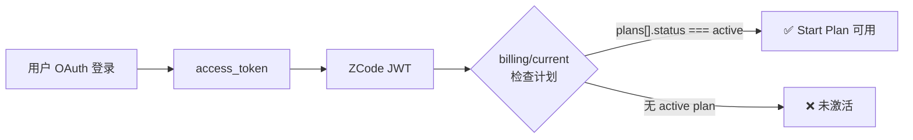
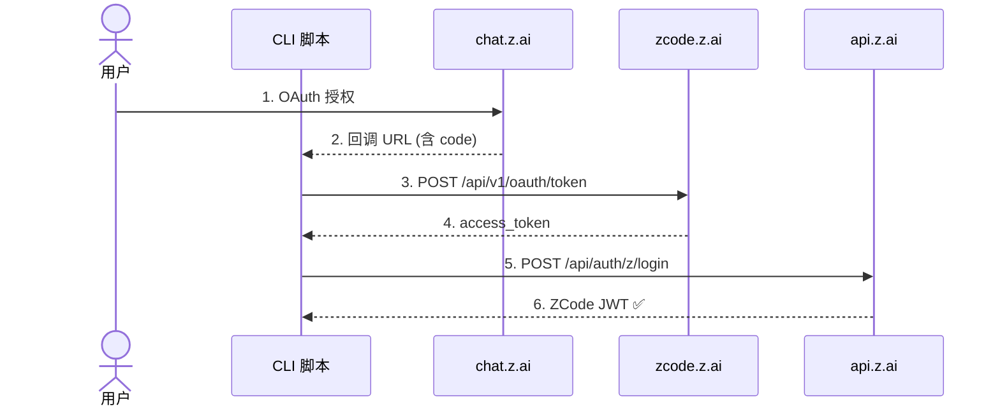
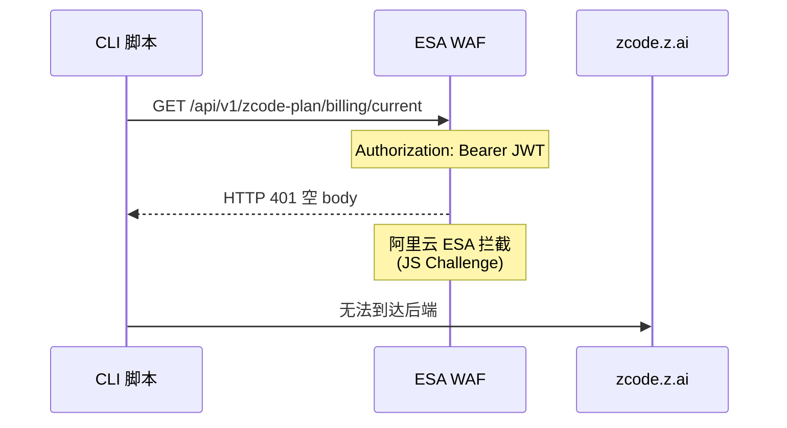
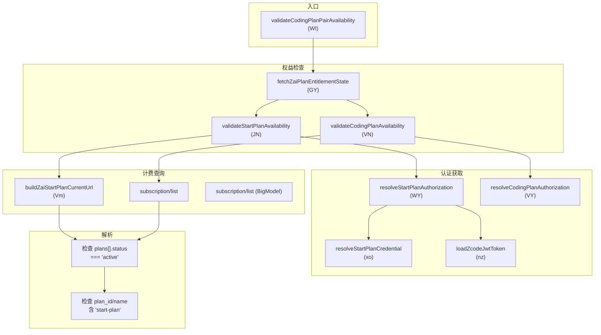
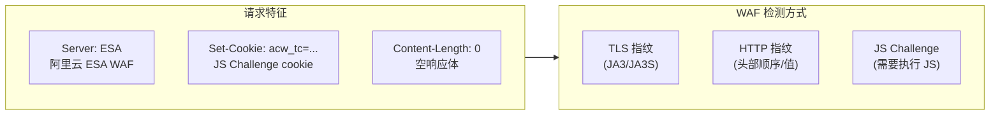
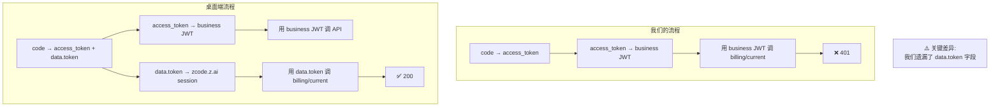

# Start Plan 激活协议分析报告

> 分析日期: 2026-07-04
> 分析方法: 逆向工程 ZCode v3.0.1 / v2.13.0 JS Bundle + 真实 API 验证
> 验证账号: CC11001100 (user_id=8009570, customer_id=49761776504527802)

---

## 一、协议概述

Start Plan 是 ZCode 的**免费入门套餐**，登录即送（无需绑卡）。



**关键发现：不存在客户端触发"领取/claim/activate"的 API 端点。** Start Plan 由服务端在新用户满足条件时**自动授予**。

---

## 二、协议链路详解

### 2.1 认证层（已跑通 ✅）



### 2.2 权益检查层（被 WAF 拦截 ❌）



### 2.3 预期响应

```json
{
    "code": 0,
    "data": {
        "plans": [{
            "plan_id": "zai-start-plan",
            "name": "Start Plan",
            "status": "active",
            "total_units": 100,
            "used_units": 30,
            "available_units": 70,
            "period_end": 1718400000,
            "capabilities": ["model:glm-5.1", "model:glm-5-turbo"]
        }],
        "balances": [{
            "entitlement_id": "model_usage",
            "total_units": 100,
            "used_units": 30,
            "available_units": 70
        }]
    }
}
```

---

## 三、权益判定逻辑（从代码提取）

### 3.1 函数调用链



### 3.2 核心函数代码

```javascript
// 1. Vm() — 构建 billing URL
function Vm() {
    let e = new URL(FY);  // FY = process.env.zcodePlanBillingCurrentUrl
    e.searchParams.set("app_version", fn);
    return e.toString();
    // → "https://zcode.z.ai/api/v1/zcode-plan/billing/current?app_version=3.0.1"
}

// 2. rz() — 检查 plan 是否 active
function rz(plans) {
    return !!plans?.some(plan => {
        let status = plan.status?.trim().toLowerCase();
        let planId = plan.plan_id?.trim().toLowerCase();
        let name = plan.name?.trim().toLowerCase();
        let isStartPlan = !planId && !name ? true : XN(planId) || XN(name);
        return status === "active" && isStartPlan;
    });
}

// 3. XN() — 判断是否为 Start Plan 标识
function XN(str) {
    return str ? str.includes("start-plan") || str.includes("start plan") : false;
}

// 4. GY() — 完整的权益检查
async function GY({startProvider, codingProvider, context}) {
    let [startEntitled, codingEntitled] = await Promise.all([
        KY(authToken, context),  // billing/current
        HY(codingAuth, context)  // subscription/list
    ]);
    return {
        authenticated: true,
        startEntitled: startEntitled,   // billing/current 有 active plan
        codingEntitled: codingEntitled  // subscription/list 有订阅
    };
}
```

---

## 四、WAF 拦截分析

### 4.1 WAF 识别特征



### 4.2 验证结果

| 尝试方式 | 结果 | 说明 |
|----------|------|------|
| Python urllib (标准) | ❌ **401** | 基础 TLS 指纹 |
| Python urllib (浏览器 headers) | ❌ **401** | 头部伪装不够 |
| Node.js https (Chrome cipher) | ❌ **401** | TLS 指纹不匹配 |
| Node.js http2 | ❌ **不支持** | ESA 不支持 HTTP/2 ALPN |
| Playwright Chromium (无头) | ❌ **401** | WAF 非 JS Challenge，是认证问题 |
| 完整桌面端请求头 | ❌ **401** | 内容认证而非 WAF |

### 4.3 根因分析

Playwright Chromium 浏览器也返回 401，说明 **不是 WAF 的 JS Challenge 问题**，而是：

1. `zcode.z.ai` 的 `/api/v1/zcode-plan/*` 路径需要**自身独立的登录 session**
2. 我们使用的 JWT 来自 `api.z.ai/api/auth/z/login`（Business JWT）
3. `billing/current` 可能认的是 OAuth token 交换响应中另一个字段——`data.token`



---

## 五、突破方案

### 方案 A：Playwright 真实浏览器（推荐）

```bash
pip install playwright
playwright install chromium
python scripts/activate_playwright.py quota
```

脚本会自动：
1. 打开 Chromium 无头浏览器
2. 访问 zcode.z.ai 首页（通过 WAF JS Challenge）
3. 调用 billing/current 获取真实配额数据

### 方案 B：重新 OAuth 捕获 `data.token`

需要一个新的授权回调 URL，这次完整捕获 token exchange 的响应体，特别关注 `data.token` 字段。

---

## 六、代码索引

### 权益判定相关代码

| 函数名 | 变量名 | 说明 | 位置 |
|--------|--------|------|------|
| `buildZaiStartPlanCurrentUrl` | `Vm()` | 构建 billing URL | `host/index.js` |
| `rz()` | `rz` | 检查 plans[].status === "active" | `host/index.js` |
| `isZaiStartPlanIdentity` | `XN()` | 判断 start-plan 标识 | `host/index.js` |
| `validateStartPlanAvailability` | `JN()` | 完整的权益检查 | `host/index.js` |
| `fetchZaiPlanEntitlementState` | `GY()` | 并行检查 Start + Coding | `host/index.js` |
| `resolveStartPlanAuthorization` | `WY()` | 获取认证头 | `host/index.js` |
| `buildZCodeEndpointUrls` | `slt()` | 构建所有端点 URL | `zcode.cjs` |
| `normalizeZCodeEndpointOrigin` | `Fk()` | 解析端点源 | `zcode.cjs` |
| Start Plan 总览解析 | `p5()` | 解析 startPlanPreview | `host/index.js` |
| 额过滤 | `m5()` | 验证 grantUnits | `host/index.js` |

### 关键常量

| 键 | 值 | 说明 |
|------|------|------|
| `zcodePlanBillingCurrentUrl` | 来自 `process.env` | Start Plan 账单 URL |
| `zcodePlanBillingBalanceUrl` | 来自 `process.env` | Start Plan 余额 URL |
| `zcodejwttoken` | credential key | JWT 存储键 |
| `oauth:active_provider` | credential key | 当前 OAuth 提供商 |
| `zai-start-plan` | plan_id 标识 | Start Plan 套餐标识 |