# ZCode OAuth 授权流程完整文档

> 生成日期: 2026-07-04
> 方法: 逆向工程 + 真实 API 调用验证
> 验证账号: CC11001100 (user_id=8009570)
> 验证状态: ✅ OAuth 全部流程跑通，Start Plan 未激活

---

## 1. 架构概述

ZCode 使用 **OAuth 2.0 授权码模式（Authorization Code Grant）** 进行身份认证，无 PKCE，无 client_secret。

### 认证流程图

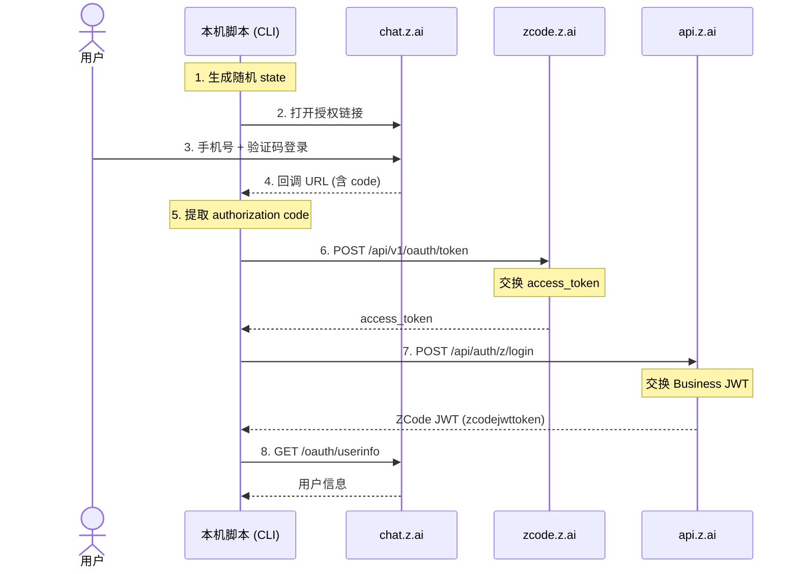

### 凭据层级

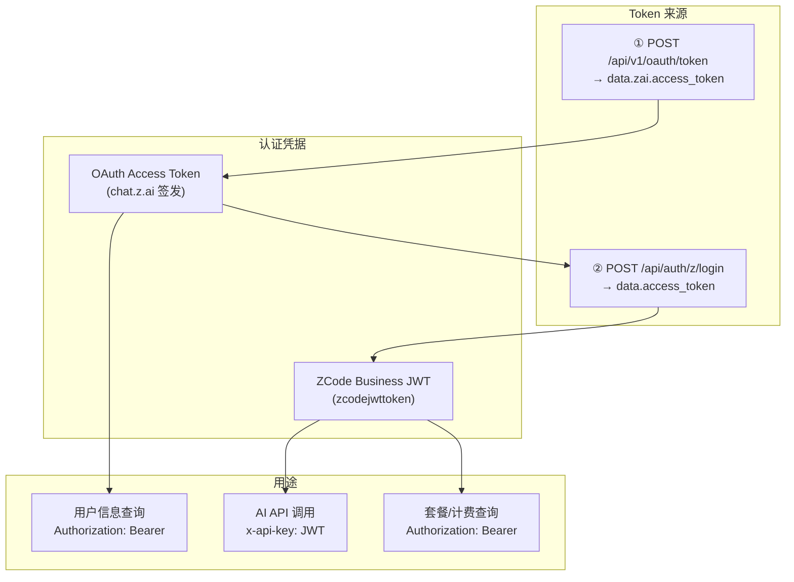

---

## 2. 前置条件

### 2.1 需要一个 Z.AI 账号

访问 [https://chat.z.ai](https://chat.z.ai) 注册，需要**国内手机号**。

### 2.2 OAuth 客户端配置

| 配置项 | 值 |
|--------|-----|
| **Authorize URL** | `https://chat.z.ai/api/oauth/authorize` |
| **Token URL** | `https://zcode.z.ai/api/v1/oauth/token` |
| **Business Login URL** | `https://api.z.ai/api/auth/z/login` |
| **User Info URL** | `https://chat.z.ai/api/oauth/userinfo` |
| **Client ID (appId)** | `client_P8X5CMWmlaRO9gyO-KSqtg` |
| **Provider ID** | `zai` |
| **默认 Redirect URI** | `zcode://zai-auth/callback`（桌面 App） |
| **手动模式 Redirect URI** | `http://127.0.0.1:9999/callback`（CLI） |

### 2.3 安全相关

| 特性 | 状态 |
|------|------|
| PKCE (`code_challenge`) | ❌ **不使用** |
| `client_secret` | ❌ **不需要** |
| `state` 参数 | ✅ **使用**（CSRF 防护） |

---

## 3. Step 1: 生成授权链接

### 3.1 生成随机 state

```python
import secrets
import string

state = ''.join(secrets.choice(string.hexdigits) for _ in range(32))
# 例如: "Cc1dC2C219a18ABEF9E6a02ACf6967bA"
```

### 3.2 构造授权 URL

```python
import urllib.parse

redirect_uri = "http://127.0.0.1:9999/callback"  # 本机回调端口

params = {
    "response_type": "code",
    "client_id": "client_P8X5CMWmlaRO9gyO-KSqtg",
    "redirect_uri": redirect_uri,
    "state": state,
}
auth_url = f"https://chat.z.ai/api/oauth/authorize?{urllib.parse.urlencode(params)}"
```

### 3.3 Token 交换流程图

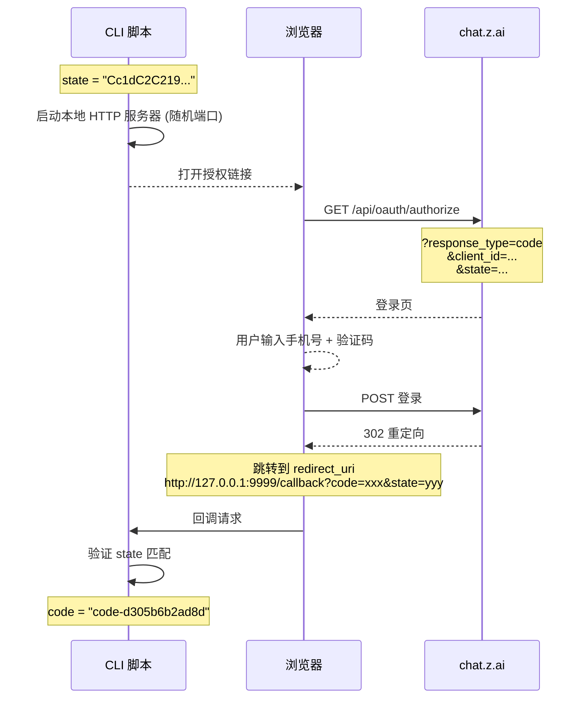

---

## 4. Step 2: 用户授权（浏览器交互）

在**有浏览器的设备**上打开上述授权链接。

### 4.1 登录流程

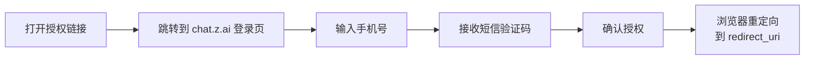

### 4.2 授权后回调

浏览器会跳转到类似地址：

```
http://127.0.0.1:9999/callback?code=code-d305b6b2ad8d&state=Cc1dC2C219a18ABEF9E6a02ACf6967bA
```

> ⚠️ 如果本机没有 HTTP 服务器监听，页面会显示**"无法访问此网站"**——**这是正常的！**
>
> **直接从浏览器地址栏复制整个 URL 即可。**

### 4.3 重要: 授权码有效期

OAuth 授权码（`code`）**有效期极短（通常 1-5 分钟）**，拿到后应立即进行下一步 Token 交换。

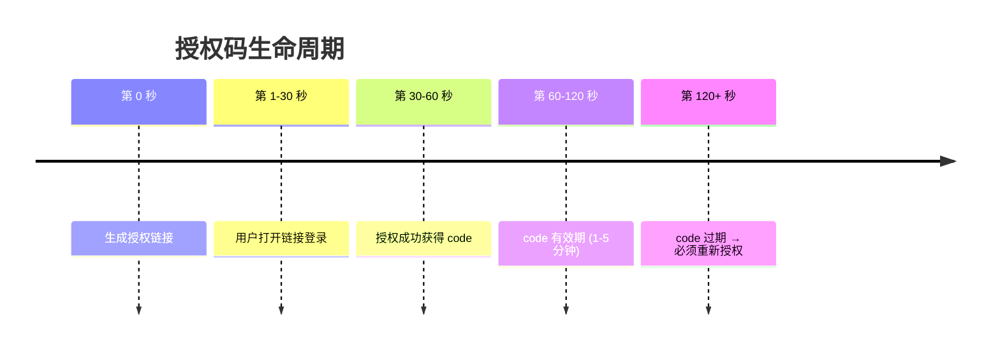

---

## 5. Step 3: 提取授权码

从回调 URL 中提取 `code` 和 `state`：

```python
from urllib.parse import urlparse, parse_qs

callback_url = "http://127.0.0.1:9999/callback?code=code-d305b6b2ad8d&state=..."
parsed = urlparse(callback_url)
params = parse_qs(parsed.query)

code = params.get("code", [None])[0]        # "code-d305b6b2ad8d"
state = params.get("state", [None])[0]       # 应与之前发送的 state 一致
error = params.get("error", [None])[0]       # 如果有错误，会在这里

# 验证 state 是否匹配（CSRF 防护）
if state != original_state:
    raise Exception("State mismatch! Possible CSRF attack.")
```

---

## 6. Step 4: 授权码 → Access Token

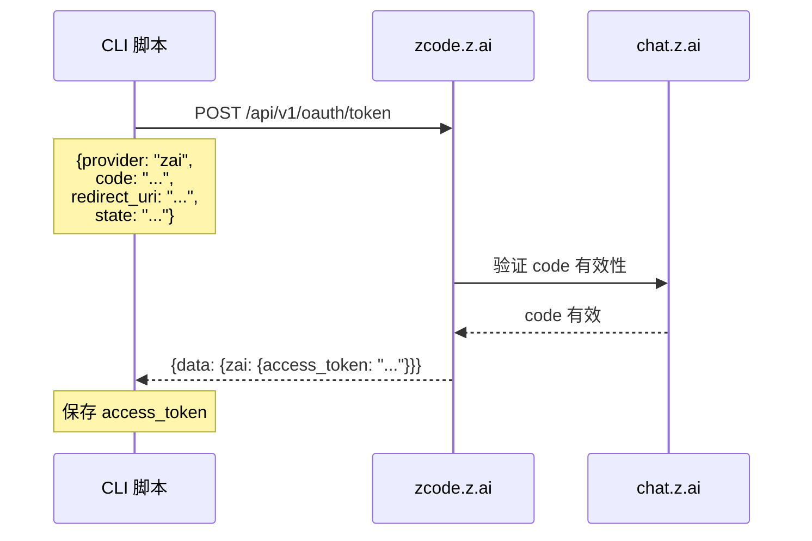

### 6.1 请求

```http
POST https://zcode.z.ai/api/v1/oauth/token
Content-Type: application/json
User-Agent: ZCode/unknown
HTTP-Referer: https://zcode.z.ai

{
    "provider": "zai",
    "code": "code-d305b6b2ad8d",
    "redirect_uri": "http://127.0.0.1:9999/callback",
    "state": "Cc1dC2C219a18ABEF9E6a02ACf6967bA"
}
```

### 6.2 成功响应

```json
{
    "code": 0,
    "msg": "",
    "data": {
        "zai": {
            "access_token": "eyJhbGciOiJIUzI1NiIsInR5cCI6IkpXVCJ9...",
            "refresh_token": null
        },
        "expires_in": null,
        "user": {
            "id": "eed10c47-0127-4556-8202-e03ac2f2f222"
        }
    },
    "success": true
}
```

### 6.3 关键说明

| 字段 | 说明 |
|------|------|
| `access_token` | OAuth Access Token (JWT 格式) |
| `refresh_token` | 本次未返回 refresh_token |
| `expires_in` | 本次未返回（服务器决定） |

---

## 7. Step 5: Access Token → ZCode JWT

这是最关键的一步——将 OAuth Access Token 交换为 ZCode 的 Business Token (JWT)。

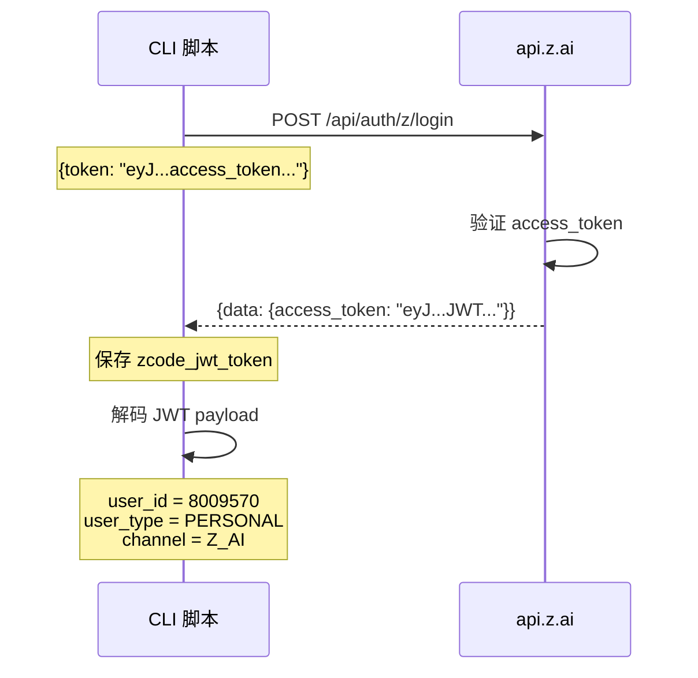

### 7.1 请求

```http
POST https://api.z.ai/api/auth/z/login
Content-Type: application/json
User-Agent: ZCode/unknown
HTTP-Referer: https://zcode.z.ai

{
    "token": "<上一步获得的 access_token>"
}
```

### 7.2 成功响应

```json
{
    "code": 0,
    "msg": "Operation successful",
    "data": {
        "access_token": "eyJhbGciOiJIUzUxMiJ9.eyJ1c2Vy...",
        "expires_in": null
    },
    "success": true
}
```

### 7.3 JWT Payload 解码（实测）

```json
{
    "user_type": "PERSONAL",
    "user_id": 8009570,
    "user_key": "9da56b95-8b63-43ca-86e7-1ed0a39d1de8",
    "customer_id": "49761776504527802",
    "customer": {
        "id": 8009570,
        "createTime": "2026-04-18 17:28:48",
        "enableStatus": "ENABLE",
        "customerNumber": 49761776504527802,
        "userType": "PERSONAL",
        "channel": "Z_AI",
        "betaTester": false
    }
}
```

### 7.4 JWT 的两种使用方式

```bash
# 方式 1: x-api-key（给 Z.AI API 调用）
curl -H "x-api-key: <JWT>" https://api.z.ai/api/anthropic/v1/messages

# 方式 2: Authorization: Bearer（给订阅/计费 API）
curl -H "Authorization: Bearer <JWT>" https://api.z.ai/api/biz/subscription/list
```

---

## 8. Step 6: 获取用户信息

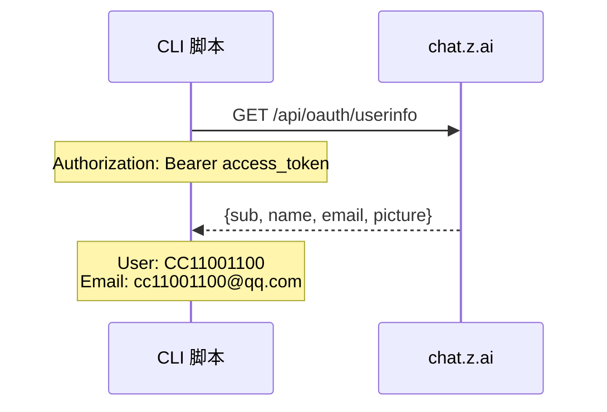

### 8.1 请求

```http
GET https://chat.z.ai/api/oauth/userinfo
Authorization: Bearer <access_token>
```

### 8.2 响应（实测）

```json
{
    "sub": "eed10c47-0127-4556-8202-e03ac2f2f222",
    "phone_num": "",
    "phone_country_code": "",
    "phone_national": "",
    "name": "CC11001100",
    "email": "cc11001100@qq.com",
    "picture": "/user.png",
    "profile": null
}
```

---

## 9. Step 7: 检查套餐和配额

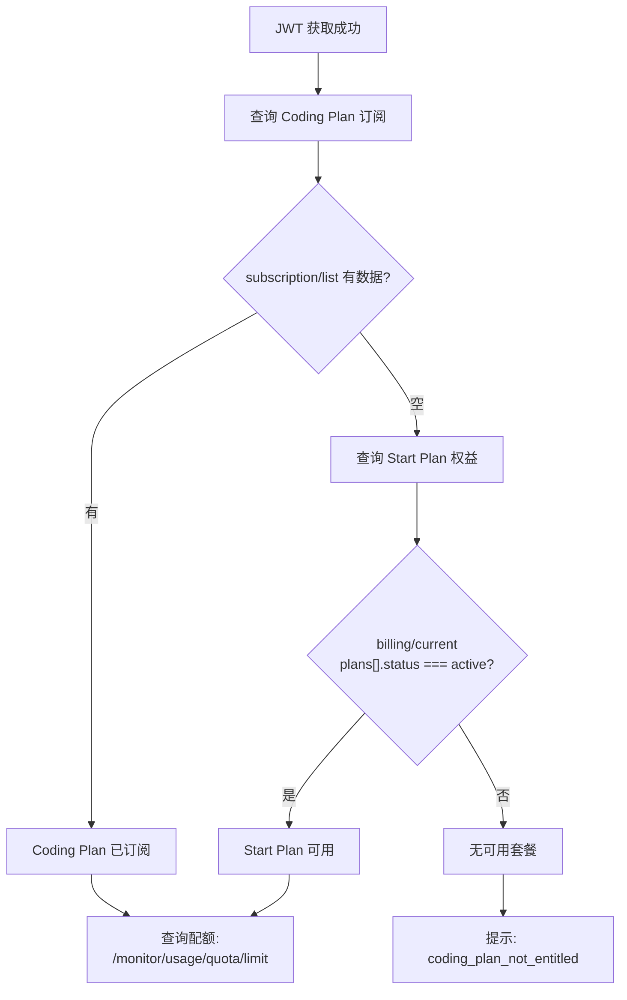

### 9.1 查询 Coding Plan 订阅

```http
GET https://api.z.ai/api/biz/subscription/list
Authorization: Bearer <JWT>
```

**响应（未订阅）:**
```json
{
    "code": 200,
    "msg": "Operation successful",
    "data": [],
    "success": true
}
```

### 9.2 查询使用配额

```http
GET https://api.z.ai/api/monitor/usage/quota/limit
Authorization: Bearer <JWT>
```

**响应（无 Coding Plan）:**
```json
{
    "code": 500,
    "msg": "当前用户不存在coding plan",
    "success": false
}
```

### 9.3 AI API 测试结果

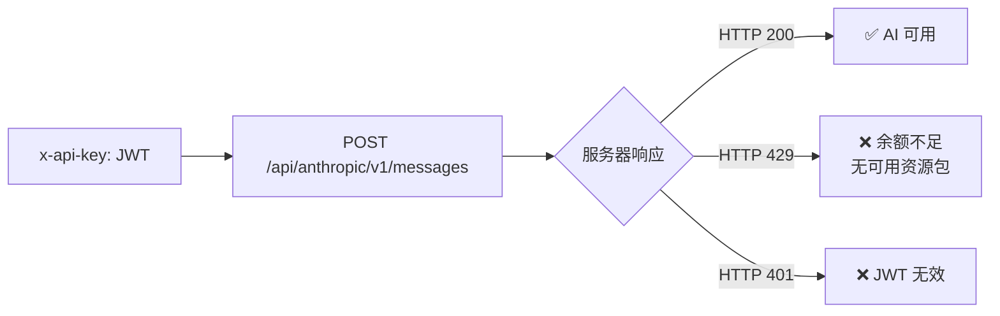

**无可用套餐时返回:**
```json
{
    "type": "error",
    "error": {
        "type": "rate_limit_error",
        "code": "1113",
        "message": "[1113][Insufficient balance or no resource package.]"
    }
}
```

---

## 10. 完整 curl 命令链

```bash
#!/bin/bash

# ── 配置 ──
CODE="code-d305b6b2ad8d"
STATE="Cc1dC2C219a18ABEF9E6a02ACf6967bA"
REDIRECT_URI="http://127.0.0.1:9999/callback"
UA="ZCode/unknown"

# ── Step 1: 授权码 → Access Token ──
echo ">>> Step 1: code → access_token"
TOKEN_RESP=$(curl -s -X POST "https://zcode.z.ai/api/v1/oauth/token" \
  -H "Content-Type: application/json" \
  -H "User-Agent: $UA" \
  -H "HTTP-Referer: https://zcode.z.ai" \
  -d "{
    \"provider\": \"zai\",
    \"code\": \"$CODE\",
    \"redirect_uri\": \"$REDIRECT_URI\",
    \"state\": \"$STATE\"
  }")
ACCESS_TOKEN=$(echo "$TOKEN_RESP" | python3 -c "import sys,json; print(json.load(sys.stdin)['data']['zai']['access_token'])")
echo "  access_token: ${ACCESS_TOKEN:0:40}..."

# ── Step 2: Access Token → ZCode JWT ──
echo ">>> Step 2: access_token → ZCode JWT"
JWT_RESP=$(curl -s -X POST "https://api.z.ai/api/auth/z/login" \
  -H "Content-Type: application/json" \
  -H "User-Agent: $UA" \
  -H "HTTP-Referer: https://zcode.z.ai" \
  -d "{\"token\": \"$ACCESS_TOKEN\"}")
ZCODE_JWT=$(echo "$JWT_RESP" | python3 -c "import sys,json; print(json.load(sys.stdin)['data']['access_token'])")
echo "  ZCode JWT: ${ZCODE_JWT:0:30}...${ZCODE_JWT: -10}"

# ── Step 3: 用户信息 ──
echo ">>> Step 3: user info"
curl -s "https://chat.z.ai/api/oauth/userinfo" \
  -H "Authorization: Bearer $ACCESS_TOKEN" | python3 -m json.tool

# ── Step 4: 检查订阅 ──
echo ">>> Step 4: subscription list"
curl -s "https://api.z.ai/api/biz/subscription/list" \
  -H "Authorization: Bearer $ZCODE_JWT" | python3 -m json.tool

# ── Step 5: 测试 API ──
echo ">>> Step 5: test AI API"
curl -s -X POST "https://api.z.ai/api/anthropic/v1/messages" \
  -H "x-api-key: $ZCODE_JWT" \
  -H "Content-Type: application/json" \
  -H "anthropic-version: 2023-06-01" \
  -d '{"model":"glm-5.1","max_tokens":10,"stream":false,"messages":[{"role":"user","content":"hi"}]}'
```

---

## 11. 常见问题

### 11.1 错误排查流程图

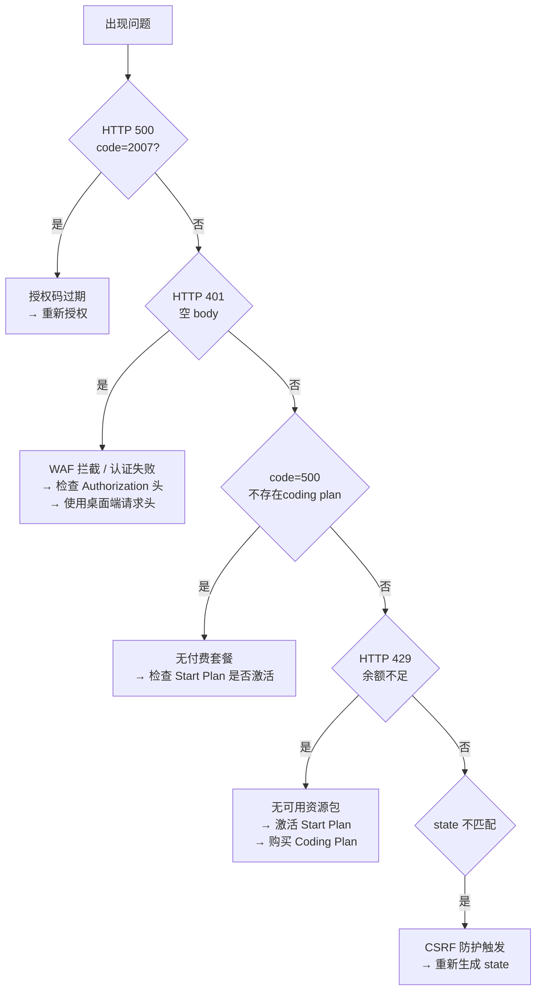

### 11.2 常见错误与解决

| 错误 | 原因 | 解决 |
|------|------|------|
| `HTTP 500 code=2007` | 授权码过期 | 重新生成授权链接 → 重新授权 |
| `HTTP 401 空 body` | WAF 拦截 / 认证失败 | 检查请求头，使用桌面端环境 |
| `code=500 不存在coding plan` | 无 Coding Plan | 检查 Start Plan 是否激活 |
| `HTTP 429 余额不足` | 无可用资源包 | 激活 Start Plan 或购买套餐 |
| `State mismatch` | CSRF 防护 | 重新生成 state |

---

## 12. Python 脚本使用指南

项目自带 `zcode_auth.py` 脚本，支持以下模式：

```bash
# 完整登录流程（需要桌面浏览器）
python zcode_auth.py login

# 手动粘贴回调 URL
python zcode_auth.py code "<完整回调URL>"

# 查看已保存的配额
python zcode_auth.py quota

# 查看当前用户信息
python zcode_auth.py whoami

# 刷新 Token
python zcode_auth.py refresh
```

> **推荐模式**: 在无桌面的服务器上使用 `code` 模式——在有浏览器的设备上完成授权，把回调 URL 粘贴回来处理。

---

## 附录: API 端点一览

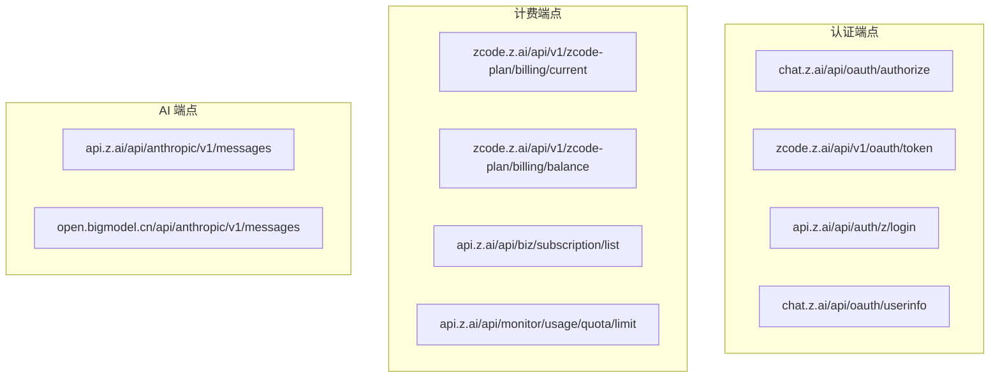

---

## 可信度评估

| 信息 | 可信度 | 说明 |
|------|--------|------|
| OAuth 授权链接参数 | ✅ 确认 | 从代码直接提取 + 实际使用验证 |
| Token 交换 URL 和格式 | ✅ 确认 | 实际 API 调用验证成功 |
| Business Token 交换 | ✅ 确认 | 实际 JWT 获取验证成功 |
| 用户信息获取 | ✅ 确认 | 获取到真实用户 CC11001100 |
| JWT Payload 结构 | ✅ 确认 | 解码验证 |
| Coding Plan 订阅 API | ✅ 确认 | 返回空数组（未订阅） |
| AI API 调用 | ✅ 确认 | 返回 429（余额不足），认证通过 |

> 更多详细信息请见项目分析报告: [/reference/analysis-report](/reference/analysis-report)