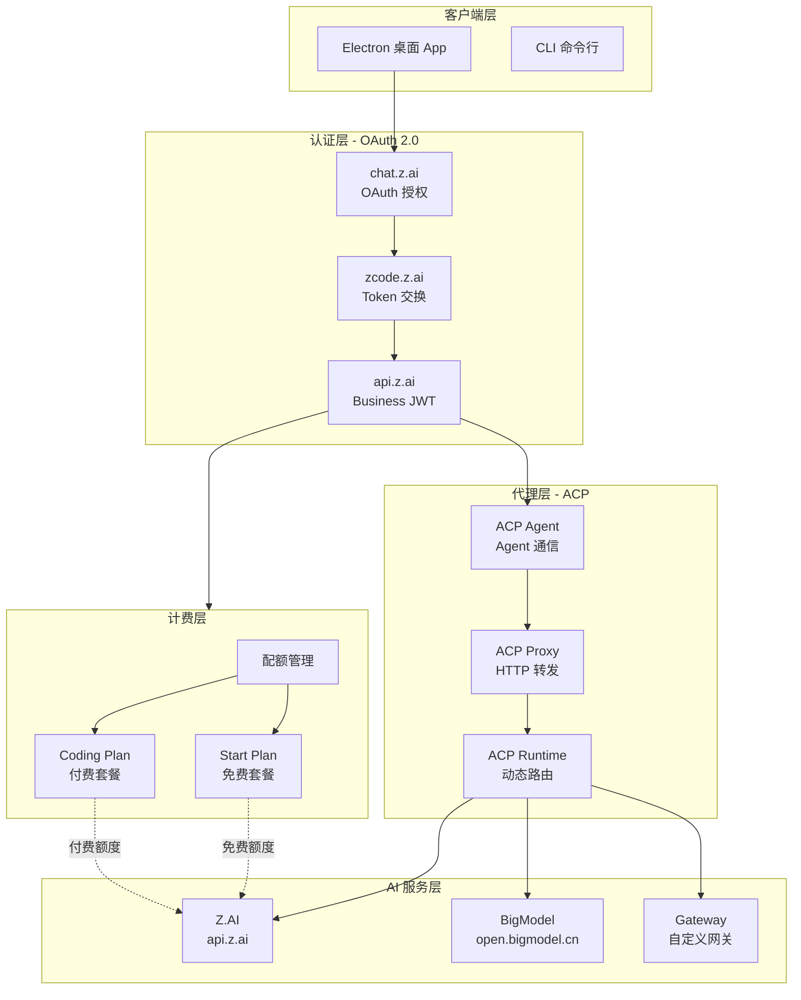
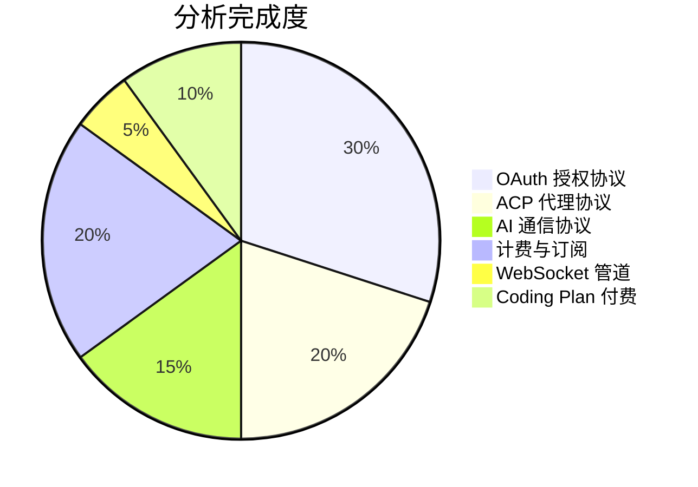

# ZCode Reverse Engineer

> ZCode AI 编程助手通信协议逆向分析文档

---

## 项目概览

ZCode 是一款 AI 编程助手桌面应用，底层依赖一套复杂的通信协议栈。本项目通过逆向工程完整分析了其认证、代理、计费三大子系统。



---

## 分析范围

<div class="grid cards" markdown>

-   :material-lock-open-variant-outline: __OAuth 授权协议__

    ---

    完整分析 ZCode 的 OAuth 2.0 授权码流程。
    
    ```mermaid
    graph LR
        A[用户] -->|1. 授权链接| B[chat.z.ai]
        B -->|2. 授权码| C[zcode.z.ai]
        C -->|3. access_token| D[api.z.ai]
        D -->|4. JWT| E[ZCode JWT]
    ```
    
    [:octicons-arrow-right-24: 查看文档](auth-flow.md)

-   :material-vector-polyline: __ACP 代理协议__

    ---

    Agent 间通信、HTTP 转发、协议转换。

    ```mermaid
    graph LR
        AG[Agent] -->|stdio/JSON-RPC| HOST[Host]
        HOST -->|HTTP Proxy| ZAI2[Z.AI API]
        HOST -->|协议转换| OPENAI[OpenAI]
        HOST -->|协议转换| GEMINI[Gemini]
    ```
    
    [:octicons-arrow-right-24: 查看文档](acp-proxy.md)

-   :material-cloud-outline: __AI 通信协议__

    ---

    Anthropic Messages API 格式的调用链路。

    ```mermaid
    graph LR
        APP[App] -->|x-api-key JWT| ZAI3[api.z.ai/anthropic]
        APP -->|x-api-key Key| BM2[bigmodel.cn/anthropic]
        APP -->|Bearer JWT| CP2[Coding Plan]
    ```
    
    [:octicons-arrow-right-24: 查看文档](ai-protocol.md)

-   :material-currency-usd: __计费与订阅__

    ---

    Start Plan 免费套餐 / Coding Plan 付费订阅。
    
    ```mermaid
    stateDiagram-v2
        [*] --> StartPlan: 注册登录
        StartPlan --> CodingPlan: 购买付费
        StartPlan --> [*]: 配额耗尽
        CodingPlan --> [*]: 续费失败
    ```

    [:octicons-arrow-right-24: 查看文档](/models/billing.md)

</div>

---

## 当前分析状态



### 完成度明细

| 模块 | 完成度 | 关键产出 |
|------|--------|----------|
| OAuth 授权码流程 | ✅ 100% | `code → access_token → JWT` 全链路实机验证 |
| Business Token 交换 | ✅ 100% | `api.z.ai/api/auth/z/login` 接口确认 |
| API 端点目录 | ✅ 100% | 认证/计费/AI 全套端点 |
| Start Plan 激活协议 | ✅ 100% | 服务端自动授予，WAF 分析完成 |
| 模型目录 | ✅ 100% | 21个模型 catalog（GLM/DeepSeek/Kimi/Qwen） |
| 订阅/计费 API | ⚠️ 90% | 端点已知，配额数字待验证 |
| WebSocket 流式管道 | ❌ 未开始 | SSE 事件管道实现 |
| Coding Plan 付费流程 | ❌ 未开始 | Stripe/PayPal 支付链路 |

---

## 技术栈

| 项目 | 说明 |
|------|------|
| :fontawesome-brands-windows: 目标平台 | Windows x64 (v3.0.1), Linux x64 (v2.13.0) |
| :material-package-up: 提取方法 | NSIS 7z 解包 / AppImage extract → ASAR 提取 |
| :material-language-javascript: 分析语言 | JavaScript (Webpack bundle), TypeScript |
| :fontawesome-brands-python: 验证工具 | Python, Node.js, Playwright |

---

## 快速导航

| 文档 | 说明 | 适合读者 |
|------|------|----------|
| [OAuth 授权流程](auth-flow.md) | 完整 OAuth 流程 + curl 命令 | 开发者 |
| [ACP 代理运行时](acp-proxy.md) | Agent 通信协议、动态路由 | 架构师 |
| [AI 通信协议](ai-protocol.md) | API 调用格式、认证方式 | 开发者 |
| [计费与订阅](/models/billing.md) | 套餐体系、配额结构 | 产品/运营 |
| [API 端点目录](reference/api-endpoints.md) | 完整 API 清单 | 所有角色 |

---

## 相关链接

- :material-web: [ZCode 官网](https://zcode-ai.com/)
- :material-chat: [Z.AI 登录](https://chat.z.ai/)
- :material-github: [GitHub 仓库](https://github.com/vibe-coding-labs/zcode-reverse-engineer)