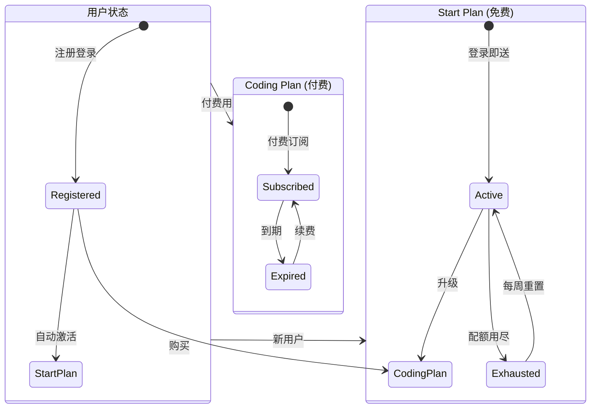
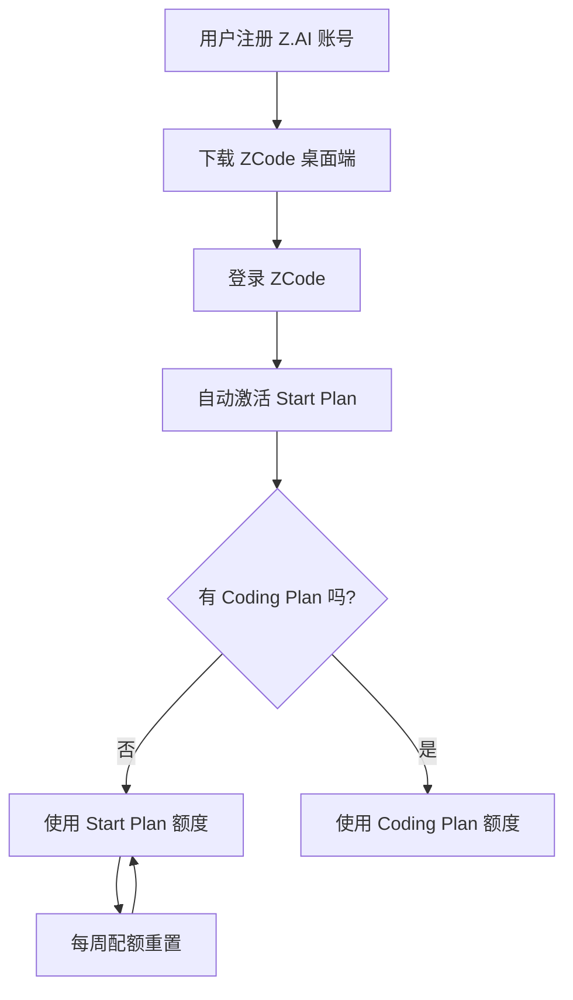
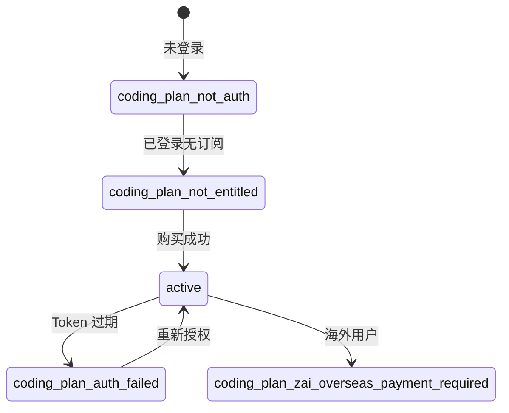
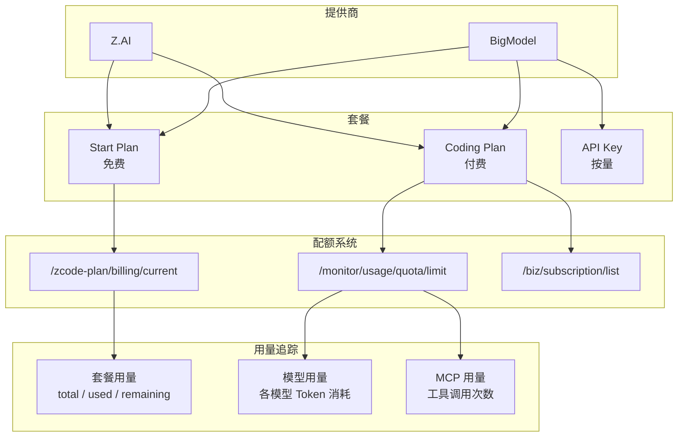

# 计费与订阅

> ZCode 的套餐体系、配额结构和计费 API 分析。

---

## 套餐体系



### 套餐对比

| 特性 | Start Plan | Coding Plan |
|------|-----------|-------------|
| :fontawesome-solid-tag: 标识 | `zaiStartPlan` / `bigmodelStartPlan` | `zaiCodingPlan` / `bigmodelCodingPlan` |
| :fontawesome-solid-credit-card: 费用 | **免费** | ¥49/月起 |
| :fontawesome-solid-robot: 可用模型 | GLM-5.2, GLM-5-Turbo | 全部 21 个模型 |
| :fontawesome-solid-gauge-high: 额度倍数 | 1x (基准) | **1.5x** (Start Plan 的 150%) |
| :fontawesome-solid-rotate: 重置周期 | 每周 | 每月 |
| :fontawesome-solid-check-circle: 绑卡 | 不需要 | 需要 |

---

## Start Plan（免费套餐）

### 激活流程



### 配额维度

| 维度 | 周期 | 说明 |
|------|------|------|
| :fontawesome-solid-clock: Prompt 池 | 5 小时 | Agent 运行时长上限 |
| :fontawesome-solid-coins: Token 配额 | 每周重置 | 具体数值由服务端控制 |
| :fontawesome-solid-toolbox: MCP 调用 | 每月重置 | 工具调用独立计数 |

### 配额检查 API

`billing/current` 响应结构：

```json
{
    "code": 0,
    "data": {
        "plans": [{
            "plan_id": "zai-start-plan",
            "name": "Z.ai Start Plan",
            "status": "active",
            "total_units": 100,
            "used_units": 30,
            "available_units": 70,
            "period_end": 1718400000,
            "capabilities": ["model:glm-5.1", "model:glm-5-turbo"]
        }],
        "balances": [{
            "entitlement_id": "model_usage",
            "total_units": 100,
            "used_units": 30,
            "available_units": 70
        }]
    }
}
```

---

## Coding Plan（付费套餐）

### 订阅状态机



### 订阅查询

```http
GET https://api.z.ai/api/biz/subscription/list
Authorization: Bearer <JWT>
```

**未订阅响应:**
```json
{
    "code": 200,
    "msg": "Operation successful",
    "data": [],
    "success": true
}
```

**已订阅响应:**
```json
{
    "code": 200,
    "data": [{
        "plan_id": "coding_plan",
        "status": "active",
        "expires_at": 1720000000
    }]
}
```

### 付费产品

| 产品 | 价格 | 说明 |
|------|------|------|
| GLM Coding Lite | ¥49/月 | 基础编程套餐 |
| GLM Coding Pro | ¥149/月 | Lite 的 5 倍额度 |
| GLM Coding Pro Max | ¥469/月 | Pro 的 4 倍额度 |

---

## 配额管理系统



---

## 权益判定优先级

```mermaid
flowchart TB
    A[用户请求] --> B{有 Coding Plan?}
    B -->|是| C{Token 有效?}
    C -->|是| D[✓ 使用 Coding Plan]
    C -->|否| E[✗ 认证失败]
    
    B -->|否| F{有 Start Plan?}
    F -->|是| G{配额充足?}
    G -->|是| H[✓ 使用 Start Plan]
    G -->|否| I[✗ 配额耗尽]
    
    F -->|否| J[✗ 无可用的套餐]
```



### 代码逻辑

```javascript
function resolveProvider(startEntitled, codingEntitled) {
    if (startEntitled && codingEntitled) {
        // 两个都有 → 优先 Coding Plan
        return { provider: "coding_plan" };
    } else if (startEntitled) {
        // 只有免费
        return { provider: "start_plan" };
    } else if (codingEntitled) {
        // 只有付费
        return { provider: "coding_plan" };
    } else {
        // 无任何权限
        return { kind: "unavailable", reason: "coding_plan_not_entitled" };
    }
}
```

---

## API 端点

| 端点 | 用途 | 认证 | 状态 |
|------|------|------|------|
| `/api/v1/zcode-plan/billing/current` | Start Plan 账单 | Bearer JWT | ⚠️ WAF |
| `/api/v1/zcode-plan/billing/balance` | Start Plan 余额 | Bearer JWT | ⚠️ WAF |
| `/api/biz/subscription/list` | Coding Plan 订阅 | Bearer JWT | ✅ |
| `/api/monitor/usage/quota/limit` | 使用配额 | Bearer JWT | ✅ |
| `/api/v1/client/configs` | 客户端配置 | 无 | ✅ |