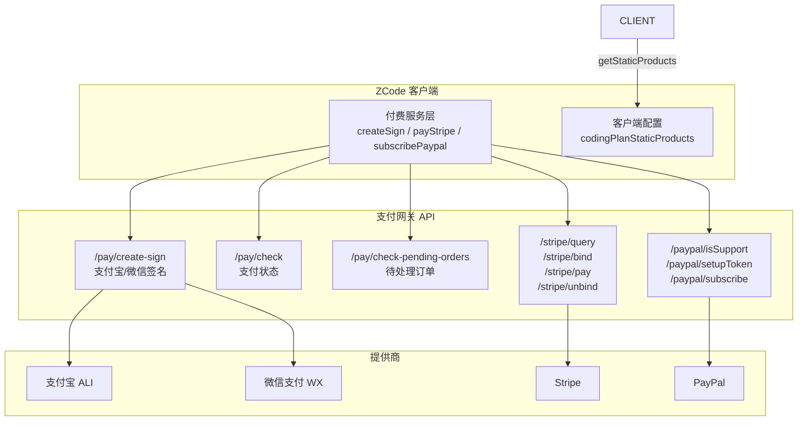
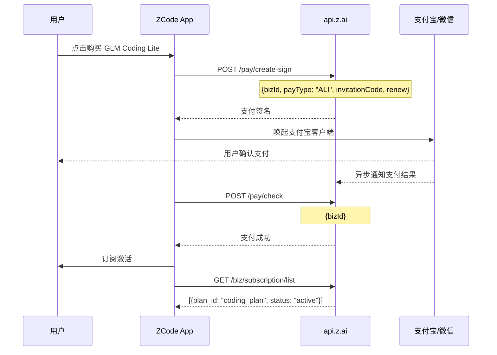
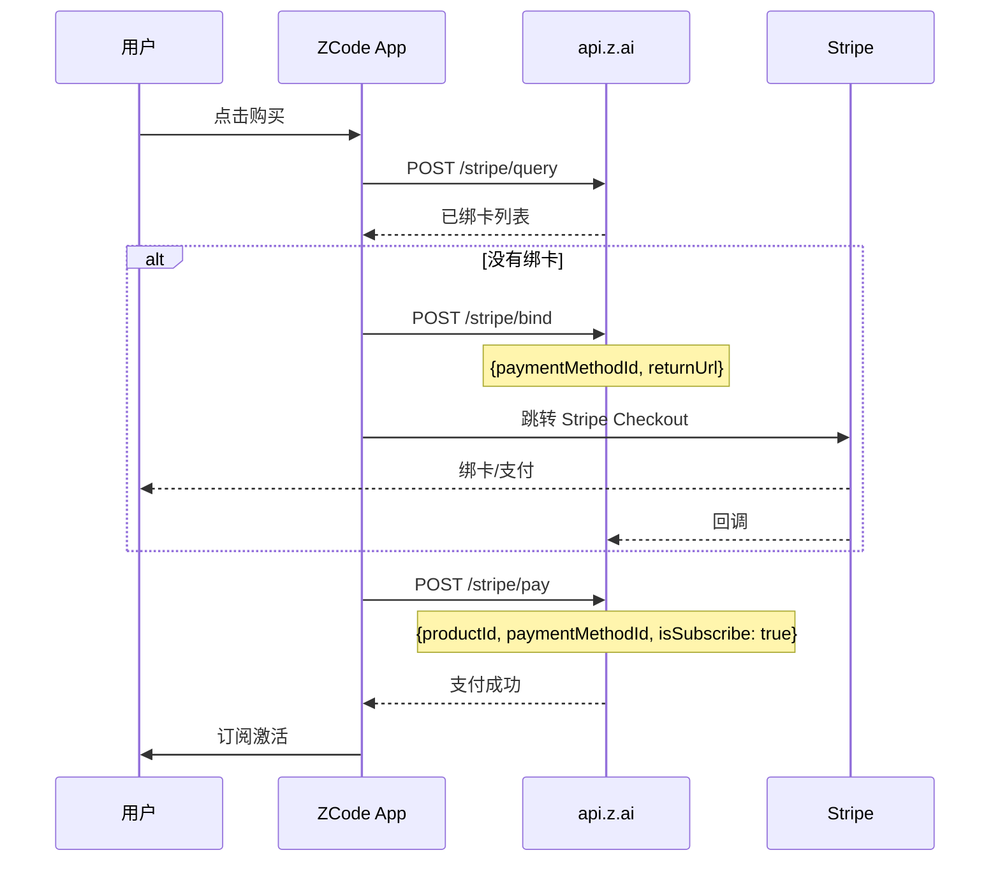
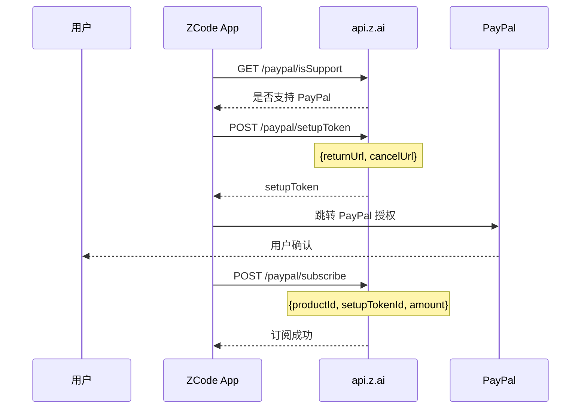
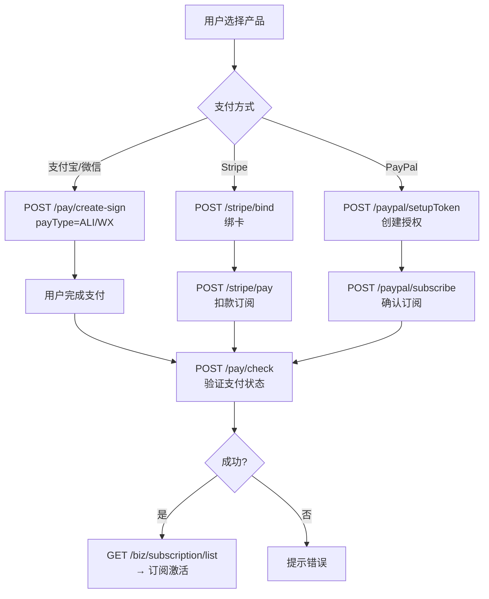

# Coding Plan 付费流程分析

> Stripe/PayPal/支付宝多渠道支付体系分析。

---

## 支付架构总览



---

## 产品定价

从客户端配置 `codingPlanStaticProducts` 提取的定价方案：

| 产品 | 价格 | 说明 |
|------|------|------|
| **GLM Coding Lite** | **¥49/月** | 基础编程套餐 |
| **GLM Coding Pro** | **¥149/月** | Lite 的 5 倍额度 |
| **GLM Coding Pro Max** | **¥469/月** | Pro 的 4 倍额度 |

### 产品配置结构

```javascript
// 从 client/configs 响应中提取
{
    "codingPlanStaticProducts": {
        "builtin:bigmodel-coding-plan": [
            {
                "productId": "product-02434c",
                "productName": "GLM Coding Lite",
                "productSmallTitle": "超值订阅，轻松畅享顶级编程体验",
                "description": "3x Claude Pro 用量额度",
                "monthlyOriginalAmount": 49,
                "monthlyPayAmount": 49,
                "monthlyRenewAmount": 49,
                "discountAmount": 49,
                "priceCurrency": "CNY",
                "priceUnit": "month",
                "displayOrder": 1,
                "productEquityList": [
                    {
                        "productEquityTitle": "GLM-5.1 驱动",
                        "productEquityDetails": "为 ZCode 编码体验优化"
                    }
                ]
            }
        ]
    }
}
```

---

## 支付流程

### 支付宝/微信支付



### Stripe 支付



### PayPal 支付



---

## API 端点

### 通用支付

| 端点 | 方法 | 说明 |
|------|------|------|
| `/pay/create-sign` | POST | 支付宝/微信支付签名 |
| `/pay/check` | GET | 查询支付状态 |
| `/pay/check-pending-orders` | GET | 待处理订单 |
| `/pay/product/update/sign` | POST | 续费签名 |

### Stripe

| 端点 | 方法 | 说明 |
|------|------|------|
| `/stripe/query` | GET | 查询已绑卡 |
| `/stripe/bind` | POST | 绑定新卡 |
| `/stripe/unbind` | POST | 解绑 |
| `/stripe/pay` | POST | 支付/订阅 |

### PayPal

| 端点 | 方法 | 说明 |
|------|------|------|
| `/paypal/isSupport` | GET | 是否支持 |
| `/paypal/setupToken` | POST | 创建授权 token |
| `/paypal/subscribe` | POST | 订阅 |

---

## 代码实现

### 支付服务层

```javascript
// source: host/index.js — 支付服务类

// 获取产品列表
async function getStaticProducts() {
    let configs = await this.getClientConfigs();
    return parseStaticProducts(configs);
}

// 查询 Stripe 已绑卡
async function queryStripeCards() {
    return this.getZaiPay(providerId, "/stripe/query");
}

// Stripe 绑卡
async function bindStripeCard(data) {
    return this.postZaiPay(providerId, "/stripe/bind", {
        paymentMethodId: data.paymentMethodId,
        returnUrl: data.returnUrl,
        trackingContext: data.trackingContext
    });
}

// Stripe 支付
async function payStripe(data) {
    return this.postZaiPay(providerId, "/stripe/pay", {
        productId: data.productId,
        paymentMethodId: data.paymentMethodId,
        isSubscribe: true,
        returnUrl: data.returnUrl,
        channelCode: data.channelCode,
        estimatePayAmount: data.estimatePayAmount,
        invitationCode: data.invitationCode
    });
}

// PayPal 订阅
async function subscribePaypal(data) {
    return this.postZaiPay(providerId, "/paypal/subscribe", {
        productId: data.productId,
        setupTokenId: data.setupTokenId,
        amount: data.amount,
        isSubscribe: true,
        estimatePayAmount: data.estimatePayAmount,
        invitationCode: data.invitationCode
    });
}

// 支付宝/微信签名
async function createSign(data) {
    return this.post(providerId, "/pay/create-sign", {
        bizId: data.bizId,
        payType: data.payType || "ALI",
        invitationCode: data.invitationCode,
        renew: data.renew
    });
}
```

---

## 订阅状态

| 状态 | 说明 |
|------|------|
| `coding_plan_zai_overseas_payment_required` | 海外用户需要额外支付验证 |
| `coding_plan_not_auth` | 未登录 |
| `coding_plan_auth_failed` | Token 过期/无效 |
| `coding_plan_not_entitled` | 无订阅 |
| `oauth_provider_inactive` | OAuth 提供商未激活 |

---

## 完整支付链路

