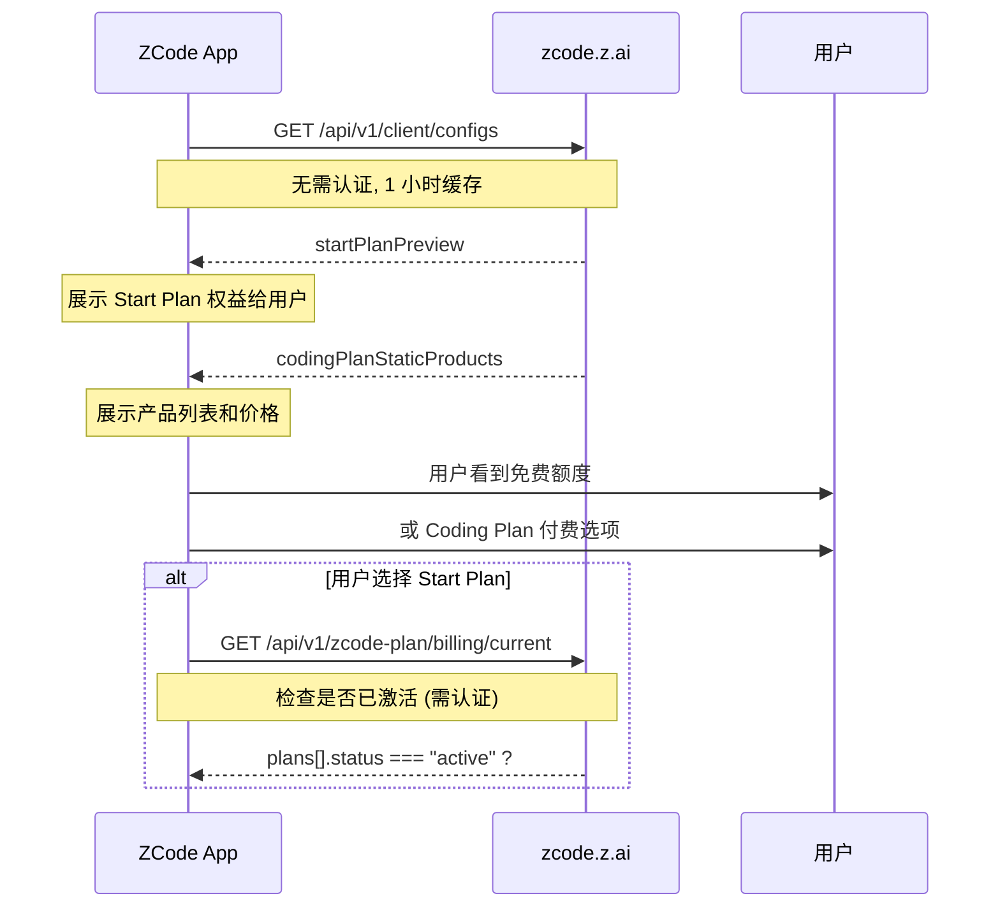

# 客户端配置与 Start Plan 额度

> 通过 `getClientConfigs()` API 获取的客户端配置结构，以及 Start Plan 的真实额度数字。

---

## 客户端配置 API

```http
GET https://zcode.z.ai/api/v1/client/configs?app_version=3.0.1
```

**不需要任何认证**，任何人都可以访问。

### 完整响应结构

```javascript
// source: host/index.js — client configs 解析
// 请求频率: 最多每 1 小时请求一次 (o5 = 3600 * 1000)
// 超时: 15 秒 (Jc = 15 * 1000)

async function getClientConfigs() {
    // 缓存检查
    if (this.clientConfigSnapshot && this.clientConfigSnapshotExpiresAt > Date.now())
        return this.clientConfigSnapshot;

    // 去重：正在请求中的等待
    if (this.clientConfigRequest)
        return await this.clientConfigRequest;

    // 构建 URL
    let url = new URL("https://zcode.z.ai/api/v1/client/configs");
    url.searchParams.set("app_version", appVersion);
    url.searchParams.set("platform", platform);

    // 发起请求
    this.clientConfigRequest = apiClient.request(url, { method: "GET", timeoutMs: 15000 });
    let response = await this.clientConfigRequest;
    
    // 缓存 1 小时
    this.clientConfigSnapshot = response;
    this.clientConfigSnapshotExpiresAt = Date.now() + 3600000;
    return response;
}
```

---

## 配置项一览

| Key | 说明 | 是否需要认证 |
|-----|------|-------------|
| `startPlanPreview` | Start Plan 预览/权益 | ❌ 不需要 |
| `codingPlanStaticProducts` | Coding Plan 产品定价 | ❌ 不需要 |
| `codingPlanBillingDiscount` | 计费折扣信息 | ❌ 不需要 |
| `captcha` | 验证码配置 | ❌ 不需要 |
| `feedbackUrl` | 反馈链接 | ❌ 不需要 |

---

## Start Plan 免费额度（真实数字！）

### 响应

```json
{
    "planId": "zcode-v3-start-plan",
    "name": "Start Plan",
    "entitlements": [
        {
            "grantUnits": 3000000,
            "meter": "model_usage",
            "period": "daily",
            "showName": "GLM-5.2",
            "unitType": "token"
        },
        {
            "grantUnits": 2000000,
            "meter": "model_usage",
            "period": "daily",
            "showName": "GLM-5-Turbo",
            "unitType": "token"
        }
    ]
}
```

### 额度汇总

| 模型 | 每日额度 | 周期 | 单位 |
|------|----------|------|------|
| **GLM-5.2** (≈ Opus 级别) | **3,000,000 tokens** | 每日 | token |
| **GLM-5-Turbo** (≈ Sonnet 级别) | **2,000,000 tokens** | 每日 | token |

> 每日 3M + 2M token，两模型独立计算，每日重置。不是之前猜测的"5 小时 prompt 池"。

---

## Coding Plan 定价

ZCode 提供两套定价体系，按渠道区分：

### BigModel 渠道

| 产品 | 价格 | 说明 |
|------|------|------|
| GLM Coding Lite | **¥49/月** | 3x Claude Pro 用量额度 |
| GLM Coding Pro | **¥149/月** | 5x Lite 用量额度 + Lite 全量权益 |
| GLM Coding Pro Max | **¥469/月** | 20x Lite 额度 + Pro 全量权益 |

### Z.AI 渠道（更便宜！）

| 产品 | 价格 | 说明 |
|------|------|------|
| GLM Coding Lite | **¥18/月** | 基础编程套餐 |
| GLM Coding Pro | **¥72/月** | 高级编程套餐 |

### 计费折扣

```json
{
    "en-US": {
        "badgeBody": "150% Quota",
        "cardTitle": "Limited-time 150% Quota Campaign",
        "cardBody": "Upgrade your Coding Plan to get 150% quota during the campaign period"
    },
    "zh-CN": {
        "badgeBody": "150% 额度",
        "cardTitle": "限时 150% 额度活动",
        "cardBody": "活动期间订阅 Coding Plan 可享受 150% 专属额度"
    }
}
```

---

## 数据流



---

## 消费端代码

```javascript
// source: host/index.js — 验证 entitlement 结构
function isValidStartPlanPreviewEntitlement(entitlement) {
    return typeof entitlement?.grantUnits === "number"
        && typeof entitlement.meter === "string"
        && typeof entitlement.period === "string"
        && typeof entitlement.showName === "string"
        && typeof entitlement.unitType === "string";
}

// source: host/index.js — 解析客户端配置
function unwrapClientConfigStartPlanPreview(response) {
    if (response.code !== 0) throw new Error("config request failed");
    
    let preview = response.data?.configs?.startPlanPreview;
    if (!preview) return null;
    
    // 验证结构完整性
    if (typeof preview.planId !== "string"
        || typeof preview.name !== "string"
        || !Array.isArray(preview.entitlements))
        throw new Error("invalid Start Plan preview");
    
    return {
        planId: preview.planId,           // "zcode-v3-start-plan"
        name: preview.name,               // "Start Plan"
        entitlements: preview.entitlements.filter(isValid)
    };
}

// 解析产品
function unwrapClientConfigStaticProducts(response) {
    return response.data?.configs?.codingPlanStaticProducts;
}

// 解析折扣
function unwrapClientConfigBillingDiscount(response) {
    let configs = response.data?.configs;
    if (configs && "codingPlanBillingDiscount" in configs) {
        return configs.codingPlanBillingDiscount;
    }
    return null;
}
```