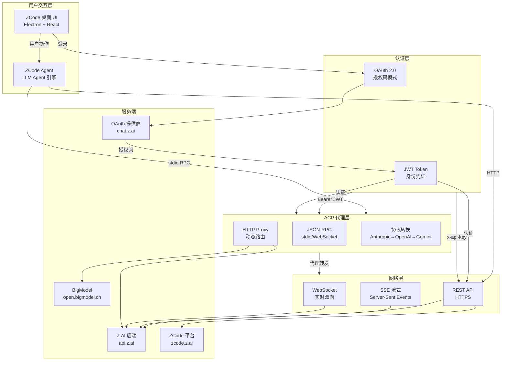
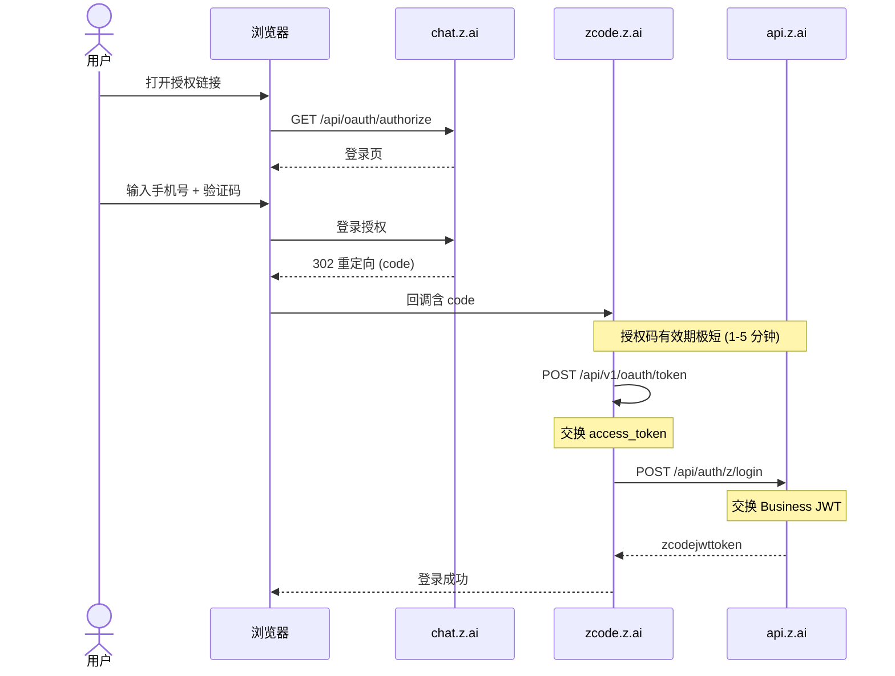
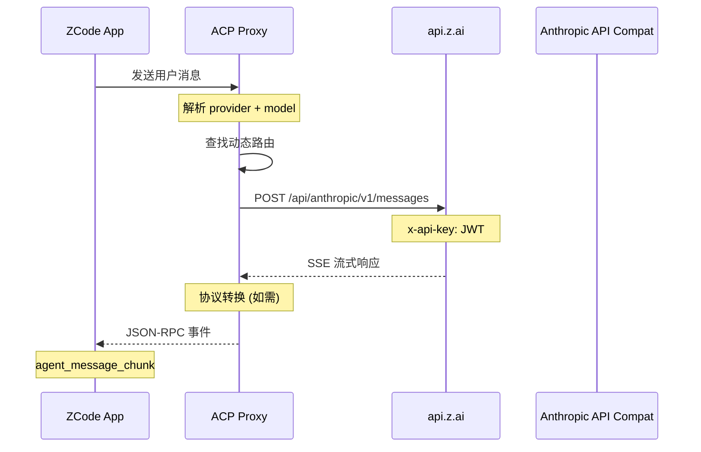
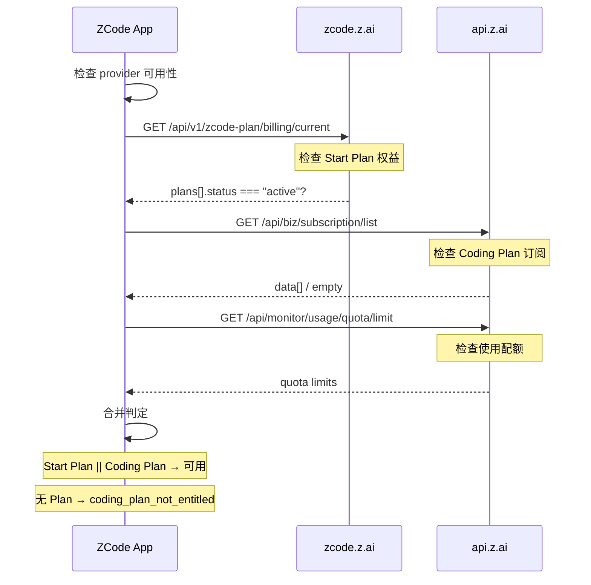

# 通信协议总览

> ZCode 的整体通信协议栈架构，从认证到 AI API 调用的完整链路。

---

## 协议栈全景

---

## 协议链路

### 认证链路

### AI API 调用链路

### 计费检查链路

---

## 协议要点

### 认证

| 特性 | 详情 |
|------|------|
| :octicons-git-commit-24: 协议 | OAuth 2.0 Authorization Code Grant |
| :octicons-lock-24: PKCE | ❌ 不使用 |
| :octicons-key-24: client_secret | ❌ 不需要 |
| :octicons-check-24: state 参数 | ✅ CSRF 防护 |
| :octicons-clock-24: Token 类型 | JWT (HS256 / HS512) |

### 通信

| 特性 | 详情 |
|------|------|
| :octicons-browser-24: API 格式 | Anthropic Messages API |
| :octicons-arrow-switch-24: 流式 | SSE (Server-Sent Events) |
| :octicons-code-24: RPC 协议 | JSON-RPC 2.0 over stdio/WebSocket |
| :octicons-shield-24: 认证方式 | `x-api-key` / `Authorization: Bearer` |

### 代理

| 特性 | 详情 |
|------|------|
| :octicons-hubot-24: Agent 通信 | ACP (Agent Communication Protocol) |
| :octicons-git-branch-24: 路由方式 | 动态路由表 + session 固定路由 |
| :octicons-versions-24: 协议转换 | Anthropic ↔ OpenAI ↔ Gemini ↔ Codex |
| :octicons-plug-24: Gateway | 自定义模型网关 |