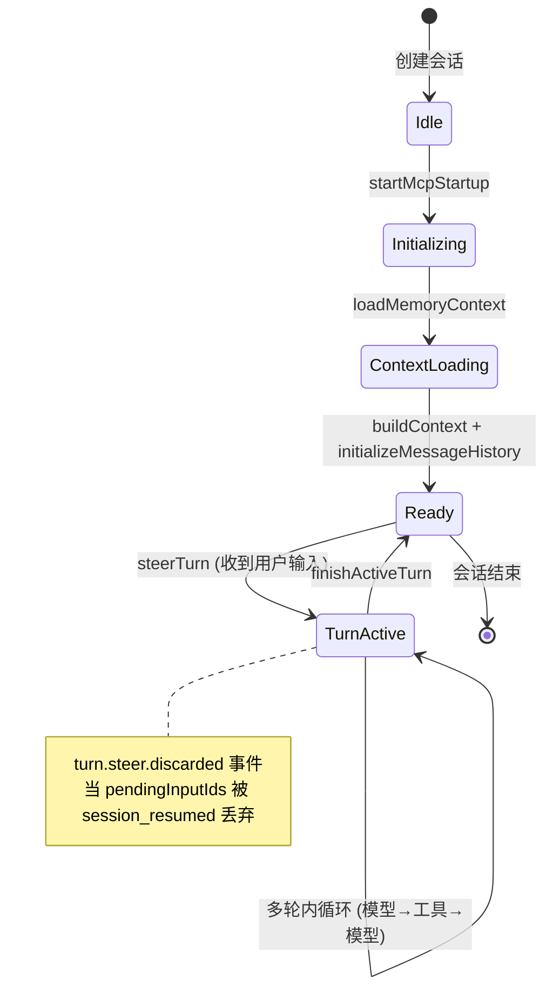
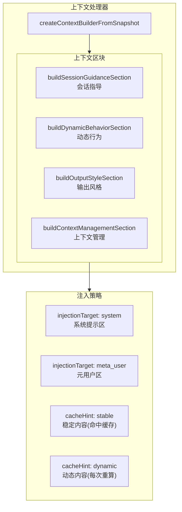
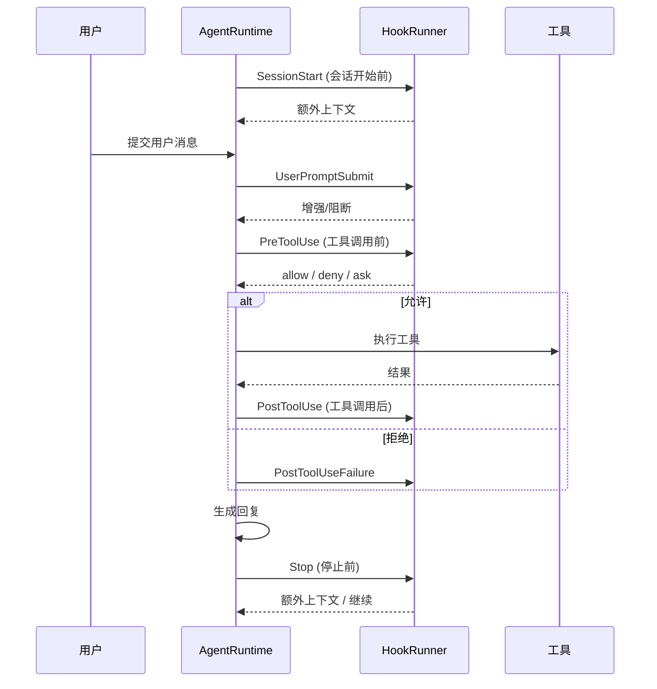
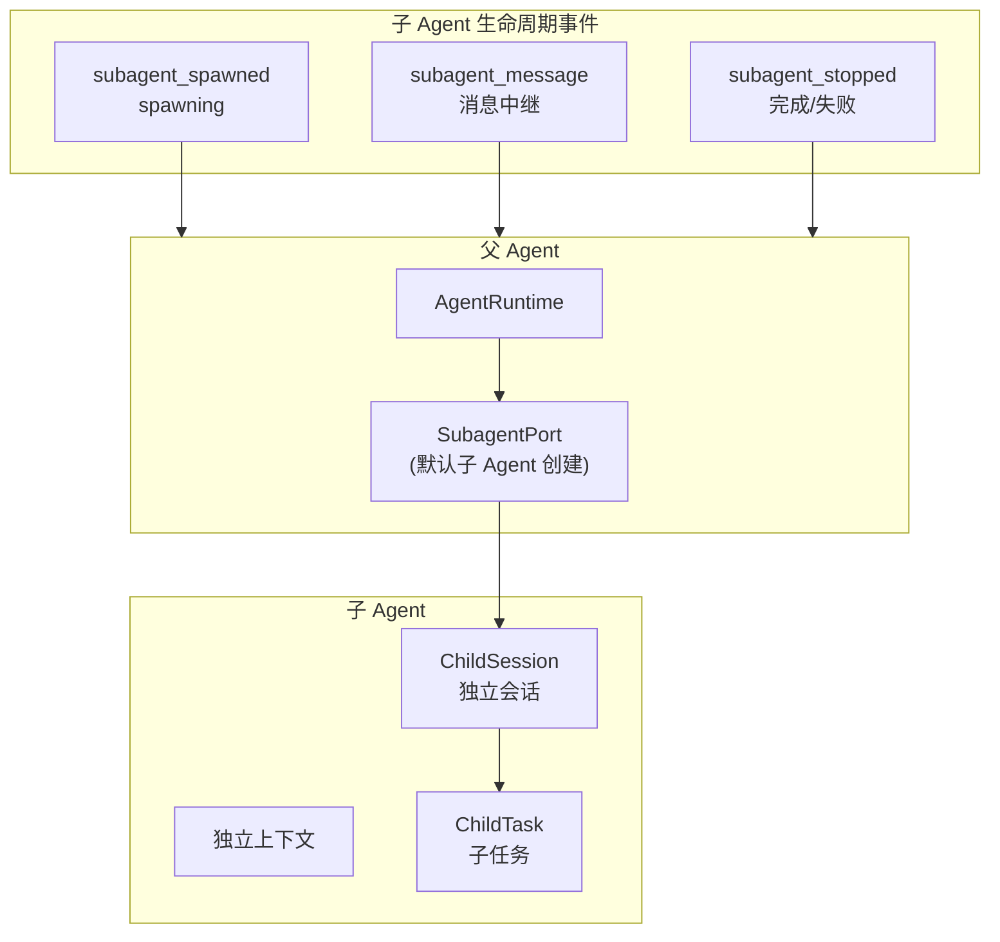
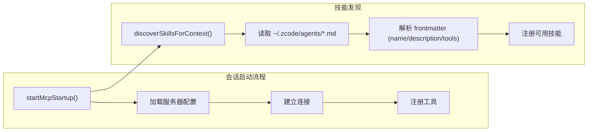

# Agent 设计的深层细节

> 对 AgentRuntime 的深度解剖：对话轮次、上下文注入、Hook 系统、子 Agent、事件总线的完整设计。

---

## 一、AgentRuntime 会话生命周期



### 核心生命周期函数

| 函数 | 注册名 | 作用 |
|------|--------|------|
| `startMcpStartup()` | AgentRuntime | 启动 MCP 服务器连接 |
| `discoverSkillsForContext()` | AgentRuntime | 发现可用技能 |
| `loadMemoryContext()` | AgentRuntime | 加载记忆上下文 |
| `createContextBuilderFromSnapshot()` | AgentRuntime | 构建上下文构建器 |
| `initializeMessageHistoryFromContext()` | AgentRuntime | 从上下文初始化消息历史 |
| `steerTurn()` | D1t | 建立新轮次（转向） |
| `beginActiveTurn()` | M1t | 开始活跃轮次 |
| `finishActiveTurn()` | z1t | 完成活跃轮次 |
| `createPendingInputId()` | R1t | 创建待处理输入 ID |
| `rejectTurnSteer()` | O1t | 拒绝轮次转向 |
| `hasPendingInput()` | N1t | 是否有待处理输入 |
| `discardPendingInput()` | L1t | 丢弃待处理输入 |

---

## 二、上下文构建系统

### 注入目标 (injectionTarget) 与缓存提示 (cacheHint)



### 注入排序规则

```javascript
// source: zcode.cjs — HRr 函数
function orderInjectionTargets(entries) {
    return [
        // 1. 系统提示 + 稳定内容（可缓存）
        ...entries.filter(e => e.injectionTarget === "system" && e.cacheHint === "stable"),
        // 2. 系统提示 + 动态内容
        ...entries.filter(e => e.injectionTarget === "system" && e.cacheHint === "dynamic"),
        // 3. 元用户 + 稳定内容
        ...entries.filter(e => e.injectionTarget === "meta_user" && e.cacheHint === "stable"),
        // 4. 元用户 + 动态内容
        ...entries.filter(e => e.injectionTarget === "meta_user" && e.cacheHint === "dynamic"),
    ];
}
```

### 注入目标枚举

| 目标 | 用途 |
|------|------|
| `system` | 注入到系统提示词 |
| `meta_user` | 注入到元用户消息（用户可见的元信息） |

### 缓存提示枚举

| 值 | 用途 | 影响 |
|----|------|------|
| `stable` | 固定内容（系统指导、行为规则） | 命中 prompt 缓存，节省 token |
| `dynamic` | 每次变化的内容（当前工作区状态） | 每次重新计算 |

---

## 三、Hook 系统（生命周期钩子）

### Hook 事件枚举

```javascript
// source: zcode.cjs — Kr (hook event)
const KR = {
    SessionStart: "SessionStart",
    UserPromptSubmit: "UserPromptSubmit",
    PreToolUse: "PreToolUse",
    PermissionRequest: "PermissionRequest",
    PostToolUse: "PostToolUse",
    PostToolUseFailure: "PostToolUseFailure",
    Stop: "Stop",
}
```



### Hook 事件与权限联动

| Hook 事件 | 输入 | 输出 |
|-----------|------|------|
| `SessionStart` | agentName, cwd | 额外上下文 |
| `UserPromptSubmit` | 用户消息 | 增强/阻断 |
| `PreToolUse` | toolName, input | `allow` / `deny` / `ask` |
| `PermissionRequest` | requestId, toolName | `allow` / `deny` 决策 |
| `PostToolUse` | toolName, output | 额外上下文 |
| `PostToolUseFailure` | toolName, error | 恢复指令 |
| `Stop` | modelResponse, toolCallCount | 额外上下文 / `continue` |

---

## 四、事件总线（内部事件系统）

### 完整事件枚举

```javascript
// source: zcode.cjs
{
    SessionStarted: "session_started",
    SessionEnded: "session_ended",
    TurnStarted: "turn_started",
    TurnInputReceived: "turn_input_received",
    TurnSteerQueued: "turn_steer_queued",
    TurnSteerDrained: "turn_steer_drained",
    PermissionRequested: "permission_requested",
    PermissionResolved: "permission_resolved",
    PermissionDenied: "permission_denied",
    HookRunStarted: "hook_run_started",
    HookRunFinished: "hook_run_finished",
    SubagentSpawned: "subagent_spawned",
    SubagentMessage: "subagent_message",
    SubagentStopped: "subagent_stopped",
    Interrupt: "interrupt",
    Cancel: "cancel",
    Resume: "resume",
}
```

---

## 五、子 Agent（Subagent）机制



### Subagent 端口

| 能力 | 说明 |
|------|------|
| 创建子 Agent | 独立会话，独立上下文 |
| 后台任务 | `background: true` 支持 |
| 消息中继 | 子 Agent 的 Notification → 父 Agent |
| 生命周期事件 | spawn → message → stopped |
| 工具集成 | 通过 `Agent` 工具暴露 |

### Subagent 状态管理

```javascript
// 父 Agent 跟踪活跃子 Agent
this.subagents.push({
    taskId: "...",
    toolCallId: "...",
    description: "执行网站抓取"
});

// 子 Agent 通知队列
this.subagentNotifications.push({
    queuedAt: new Date(),
    text: "子任务完成",
    traceContext: "..."
});
```

---

## 六、权限请求事件

```javascript
// source: zcode.cjs — PermissionRequested 事件 payload
{
    type: "permission_requested",
    timestamp: new Date(),
    traceId: "...",
    sequenceNumber: 0,
    payload: {
        requestId: "...",
        toolCallId: "...",
        toolName: "bash",
        riskLevel: "high",          // 风险级别
        reason: "Tool bash requires approval"
    }
}
```

---

## 七、模型能力与特性开关

```javascript
// source: zcode.cjs — 特性门控
{
    Subagent: "features.subagent",     // 子 Agent 能力开关
    FeatureMemory: "features.memory",  // 记忆功能
    FeatureSkill: "features.skill",    // 技能功能
    FeatureMcp: "features.mcp",        // MCP 功能
    MemoryUse: "memory.use",           // 记忆使用
    MemoryWrite: "memory.write",       // 记忆写入
}
```

### 记忆上下文

```javascript
// source: zcode.cjs — 记忆系统函数
{
    loadMemoryContext: l1t,                    // 加载记忆
    logMemorySkipped: c1t,                     // 记忆跳过日志
    recordExplicitMemoryFromTurn: xwt,         // 记录显式记忆
    writeConsolidatedMemoryFiles: vwt,         // 写入合并记忆文件
    injectRelevantMemoryFromTurn: kwt,         // 注入相关记忆
    logMemoryWriteSkipped: ywt,                // 记忆写入跳过日志
    logMemoryRecallSkipped: S1t,               // 记忆回忆跳过日志
}
```

---

## 八、MCP 启动与技能发现



---

## 关键代码索引

| 模块 | 位置 | 说明 |
|------|------|------|
| `steerTurn` | zcode.cjs | 轮次转向 |
| `beginActiveTurn` / `finishActiveTurn` | zcode.cjs | 活跃轮次生命周期 |
| `HRr` | zcode.cjs | 注入目标排序 |
| `Ks.js` / `injectionTarget` | zcode.cjs | 上下文注入策略 |
| `HookRunner` | zcode.cjs | Hook 执行器 |
| `PermissionRequested` | zcode.cjs | 权限请求事件 |
| `SubagentPort` | zcode.cjs | 子 Agent 端口 |
| 记忆系统 | zcode.cjs | `loadMemoryContext` 等 7 函数 |