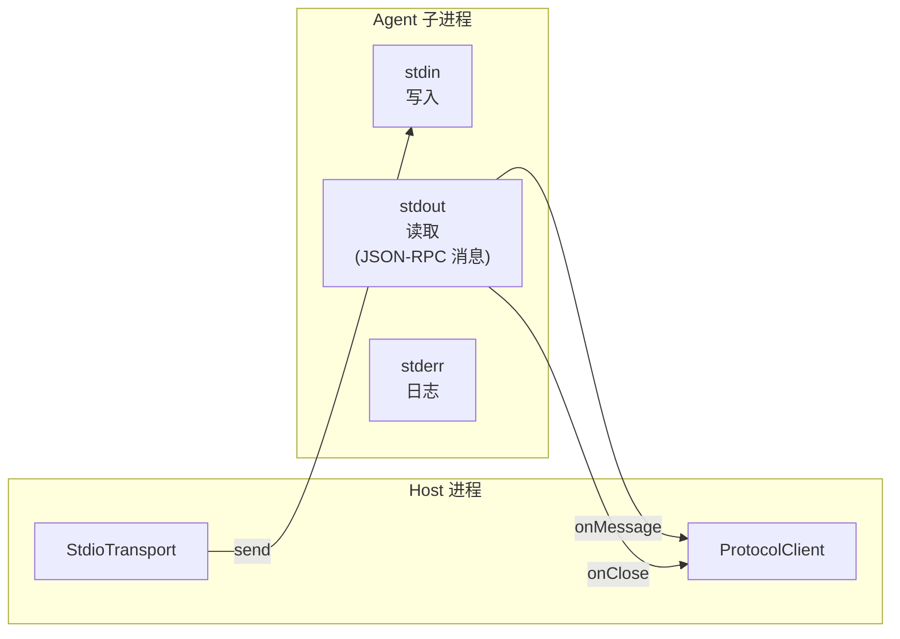
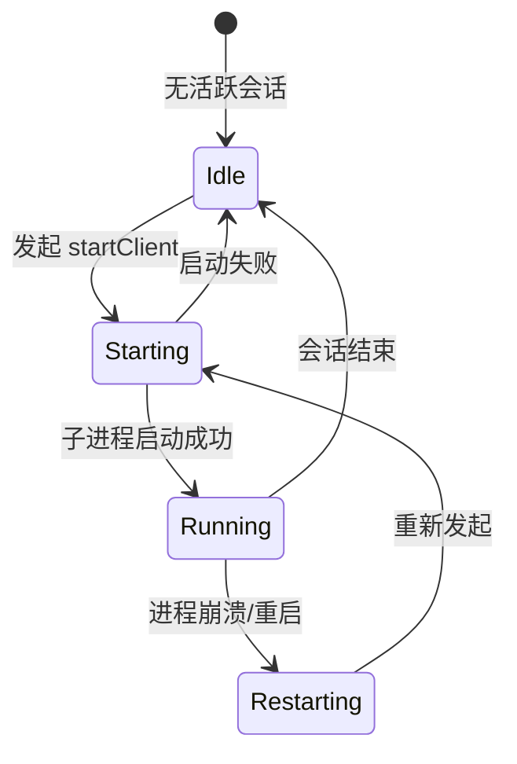
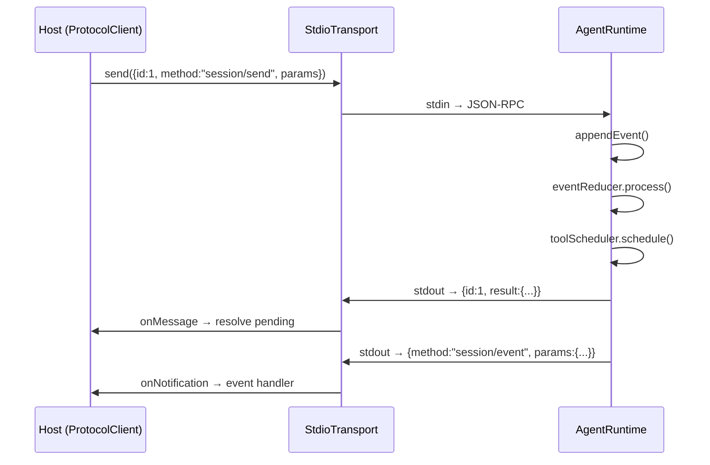

# Agent 运行时引擎

> `AgentRuntime` — ZCode/GLM Agent 的核心运行时，管理会话生命周期、工具调度、事件处理。

---

## 架构

```mermaid
graph TB
    subgraph Host["Host 进程"]
        PC["ZCodeProtocolClient<br/>JSON-RPC 客户端"]
        ST["ZCodeStdioTransport<br/>stdio 传输层"]
        PM["ZCodeAgentProcessManager<br/>进程管理器"]
    end

    subgraph Agent["Agent 进程 (zcode-acp)"]
        AR["AgentRuntime<br/>核心引擎"]
    end

    subgraph Services["运行时服务"]
        TS["ToolScheduler<br/>工具调度器"]
        ER["EventReducer<br/>事件规约器"]
        ES["EventStore<br/>事件存储"]
        PS["PermissionService<br/>权限服务"]
        PB["PermissionBroker<br/>权限代理"]
        HR["HookRunner<br/>Hook 执行器"]
    end

    subgraph Ports["端口层"]
        CP["ContextSourcePort<br/>上下文源"]
        SP["SkillPort<br/>技能"]
        MP["MCPPort<br/>MCP 工具"]
        SAP["SubagentPort<br/>子 Agent"]
        AS["ArtifactStore<br/>工件存储"]
        EP["ExecutionPort<br/>命令执行"]
        FP["FileSystemPort<br/>文件系统"]
    end

    subgraph Model["模型层"]
        MA["ModelAdapter<br/>模型适配器"]
        MCP["ModelConnectionPort<br/>模型连接"]
        PRH["ProviderRuntimeHeadersPort<br/>请求头"]
    end

    Host -->|"stdio JSON-RPC"| Agent
    PM -->|"spawn child_process"| Agent
    PC --> ST
    AR --> TS
    AR --> ER
    AR --> ES
    AR --> PS
    AR --> PB
    AR --> HR
    AR --> CP
    AR --> SP
    AR --> MP
    AR --> SAP
    AR --> AS
    AR --> EP
    AR --> FP
    AR --> MA
    AR --> MCP
    AR --> PRH
```



---

## ProtocolClient (JSON-RPC)

`ZCodeProtocolClient` 是 Host 与 Agent 之间的通信客户端：

```javascript
// source: host/index.js — ZCodeProtocolClient
class ZCodeProtocolClient {
    transport;              // Transport 层 (stdio/websocket)
    pending = new Map();    // 等待响应的请求 (requestId → {resolve, reject, timeout})
    nextRequestId = 1;
    requestTimeoutMs = 30000;

    // JSON-RPC 请求 (需要响应)
    async request(method, params, resultSchema, trace) {
        let id = this.nextRequestId++;
        let promise = new Promise((resolve, reject) => {
            let timeout = setTimeout(() => {
                reject(new ZCodeProtocolRequestTimeoutError(method, id));
            }, this.requestTimeoutMs);
            this.pending.set(id, { method, timeout, resolve, reject });
        });
        await this.transport.send({ id, method, params, ...trace });
        return promise;
    }

    // JSON-RPC 通知 (无需响应)
    async notify(method, params) {
        await this.transport.send({ method, params });
    }

    // JSON-RPC 响应
    async respond(id, result) {
        await this.transport.send({ id, result });
    }
}
```

### JSON-RPC 消息格式

| 方向 | 类型 | 格式 |
|------|------|------|
| Host → Agent | 请求 | `{ id, method, params, trace? }` |
| Agent → Host | 响应 | `{ id, result }` |
| Agent → Host | 错误 | `{ id, error: { code, message, data? } }` |
| 双向 | 通知 | `{ method, params }` |

---

## StdioTransport

ZCode 使用 stdio 作为默认传输层：



```javascript
// source: host/index.js — ZCodeStdioTransport
{
    kind: "stdio",
    messageEmitter: new EventEmitter(),
    closeEmitter: new EventEmitter(),
    
    // 通过 child_process stdin 写入 JSON-RPC 消息
    send(message) { ... }
    
    // 通过 child_process stdout 读取 JSON-RPC 响应
    onMessage: this.messageEmitter.event,
    onClose: this.closeEmitter.event
}
```

---

## AgentProcessManager

进程管理器负责 Agent 子进程的生命周期：



```javascript
// source: host/index.js — ZCodeAgentProcessManager
class ZCodeAgentProcessManager {
    processesByWorkspaceKey = new Map();
    startingByWorkspaceKey = new Map();
    restartGenerationByWorkspaceKey = new Map();
    
    // 获取或创建 Agent 客户端
    async getClient(workspaceConfig) {
        let key = canonicalize(workspaceConfig);
        
        // 1. 如果已有活跃进程 → 直接返回
        if (active && !child.killed) return active.client;
        
        // 2. 如果正在启动 → 等待
        if (starting) return await starting;
        
        // 3. 启动新进程
        return await this.startClient(workspaceConfig, key);
    }
    
    async startClient(config, key) {
        // 1. 解析命令
        let command = await this.commandResolver(config);
        
        // 2. 构建环境变量
        let env = await this.resolveSpawnEnv();
        
        // 3. spawn 子进程
        let child = spawn(command, { stdio: ["pipe", "pipe", "pipe"] });
        
        // 4. 创建 Transport + ProtocolClient
        let transport = new ZCodeStdioTransport(child);
        let client = new ZCodeProtocolClient(transport);
        
        // 5. 缓存并返回
        this.processesByWorkspaceKey.set(key, { child, client });
        return client;
    }
}
```

---

## AgentRuntime（核心引擎）

`AgentRuntime` 是 zcode.cjs 中 Agent 运行时的核心类，9.4MB JS bundle 的心脏：

```javascript
// source: zcode.cjs — AgentRuntime 类
class AgentRuntime {
    // 会话标识
    sessionId;          // 会话 ID
    turnNumber = 0;     // 轮次计数
    config;             // 运行时配置
    
    // 核心服务
    permissionService;  // 权限服务
    permissionBroker;   // 权限代理
    toolScheduler;      // 工具调度器 (最大并发)
    eventReducer;       // 事件规约器
    eventStore;         // 事件存储
    eventSinks = new Set();  // 事件槽 (持久化)
    
    // 端口注入 (依赖倒置)
    contextSourcePort;  // 上下文源
    skillPort;          // 技能
    mcpPort;            // MCP 工具
    subagentPort;       // 子 Agent
    artifactStore;      // 工件存储
    executionPort;      // 命令执行
    fileSystemPort;     // 文件系统
    imageProcessorPort; // 图像处理
    
    // 模型
    modelAdapter;       // 模型适配器
    modelConnectionPort;// 模型连接端口
    providerRuntimeHeadersPort; // 运行时请求头
    defaultModelRef;    // 默认模型引用
    
    // 工具注册
    registry;           // 工具注册表
    cachedTools = null; // 工具缓存
    
    // 会话状态
    messageHistory;      // 消息历史
    latestConsumerMessageId;
    latestProviderContextUsage;
    turnCacheHitAggregate = { requestCount: 0, totalInputTokens: 0, ... };
    lastAssistantCompletedAtMs;
    activeTurn;         // 当前活跃轮次
    
    // 生命周期钩子
    sessionStartHookRan = false;
    sessionTitleGenerationAttempted = false;
    
    // 事件
    eventSinks = new Set();     // 事件接收器
    pendingSubagentNotifications = [];
    pendingBackgroundTaskNotifications = [];
}
```

---

## 事件流



---

## Agent 工具注册

`AgentRuntime` 的工具注册表包含：

| 工具类型 | 来源 | 说明 |
|----------|------|------|
| 内置工具 | `OSt()` | 白名单过滤 |
| 技能 | `skillPort` | 用户安装的技能 |
| Agent | `subagentPort` | 子 Agent 调用 |
| 发送消息 | `sessionMailboxPort` | 跨会话消息 |
| 工作流 | `workflowPort` | 工作流引擎 |
| MCP | `mcpPort` | MCP 服务器工具 |
| Hook | `hookRunner` | 生命周期钩子 |

---

## 关键代码索引

| 类/函数 | 位置 | 说明 |
|---------|------|------|
| `ZCodeProtocolClient` | host/index.js | JSON-RPC 客户端 |
| `ZCodeStdioTransport` | host/index.js | stdio 传输层 |
| `ZCodeAgentProcessManager` | host/index.js | Agent 进程管理 |
| `AgentRuntime` | zcode.cjs | Agent 核心引擎 |
| `ToolScheduler` | zcode.cjs | 工具调度器 |
| `EventReducer` | zcode.cjs | 事件规约器 |
| `PermissionService` | zcode.cjs | 权限服务 |