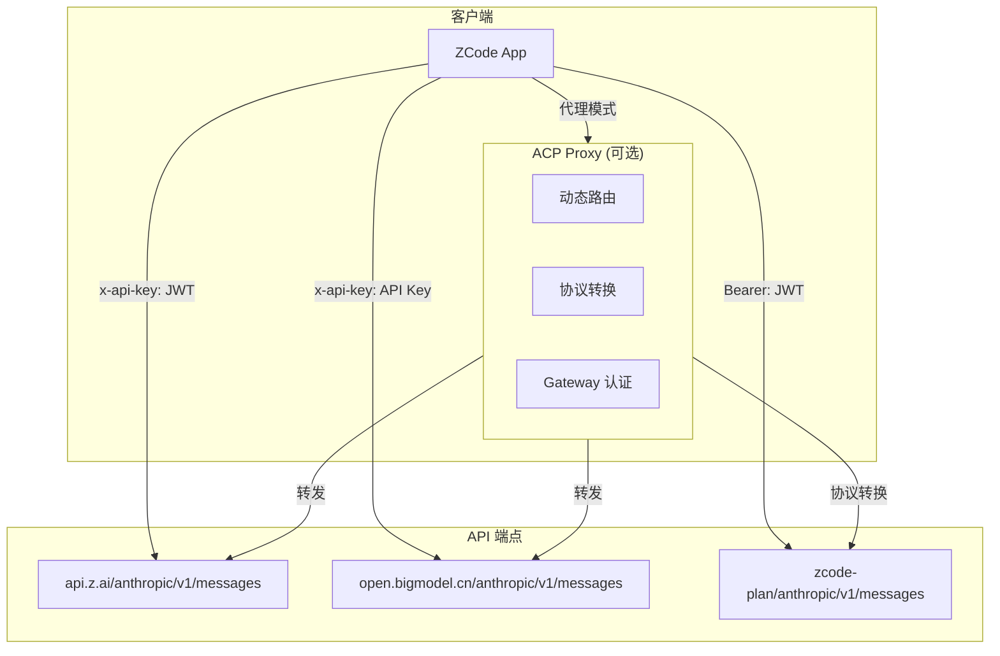
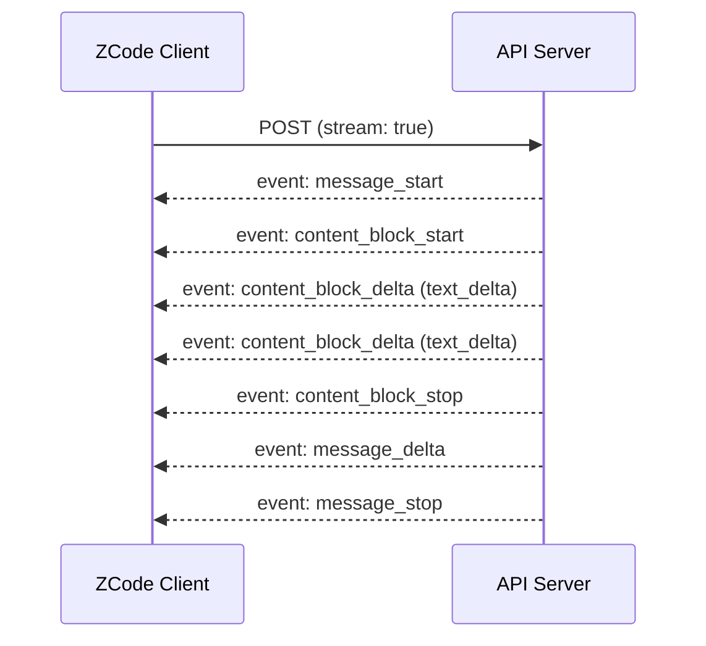
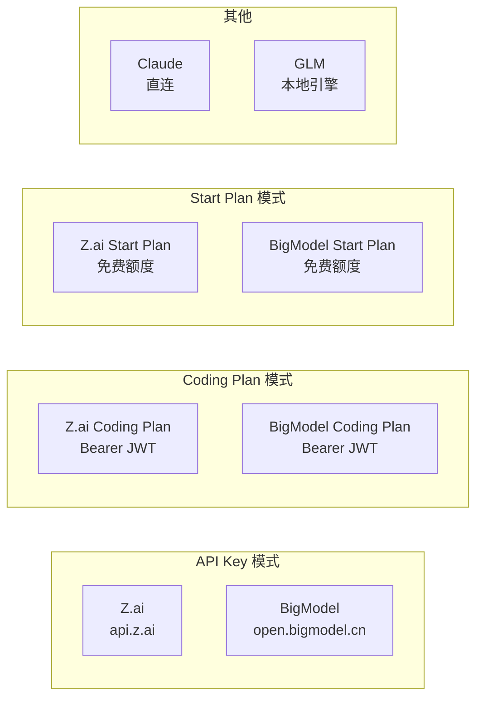
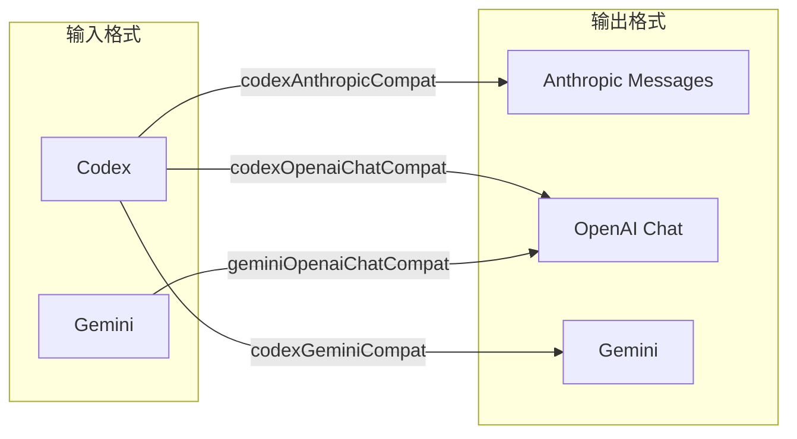

# AI 通信协议

> ZCode 与 AI 模型之间的通信协议，基于 Anthropic Messages API 格式。

---

## 架构



---

## API 端点

| 提供商 | 端点 | 认证方式 | 说明 |
|--------|------|---------|------|
| **Z.AI (默认)** | `https://api.z.ai/api/anthropic/v1/messages` | `x-api-key: <JWT>` | 免费/付费额度 |
| **BigModel** | `https://open.bigmodel.cn/api/anthropic/v1/messages` | `x-api-key: <API Key>` | 独立 API Key |
| **Coding Plan** | 运行时配置 `zcodePlanAnthropicBaseUrl` + `/v1/messages` | `Authorization: Bearer <JWT>` | 套餐专属 |

---

## 请求格式

### 请求头

```http
POST https://api.z.ai/api/anthropic/v1/messages
Content-Type: application/json
x-api-key: <zcode_jwt_token>
anthropic-version: 2023-06-01
User-Agent: ZCode/3.0.1
HTTP-Referer: https://zcode.z.ai
X-Title: Z Code@electron
X-Platform: win32-x64
X-ZCode-App-Version: 3.0.1
X-Release-Channel: production
X-Client-Language: zh-CN
X-Client-Timezone: Asia/Shanghai
X-Os-Category: windows
```

### 请求体

```json
{
    "model": "glm-5.1",
    "max_tokens": 64000,
    "temperature": 0.2,
    "stream": true,
    "system": [
        {"type": "text", "text": "You are ZCode, an AI coding assistant."}
    ],
    "messages": [
        {"role": "user", "content": [
            {"type": "text", "text": "Hello, explain this code..."}
        ]}
    ],
    "thinking": {
        "type": "enabled",
        "budget_tokens": 1024
    }
}
```

---

## 流式响应

### SSE 事件流



### 事件格式

```sse
event: message_start
data: {"type":"message_start","message":{"id":"msg_...","type":"message","role":"assistant","content":[],"model":"glm-5.1","stop_reason":null,"stop_sequence":null,"usage":{"input_tokens":10,"output_tokens":1}}}

event: content_block_start
data: {"type":"content_block_start","index":0,"content_block":{"type":"text","text":""}}

event: content_block_delta
data: {"type":"content_block_delta","index":0,"delta":{"type":"text_delta","text":"Hello! "}}

event: content_block_delta
data: {"type":"content_block_delta","index":0,"delta":{"type":"text_delta","text":"How can I help?"}}

event: content_block_stop
data: {"type":"content_block_stop","index":0}

event: message_delta
data: {"type":"message_delta","delta":{"stop_reason":"end_turn","stop_sequence":null},"usage":{"output_tokens":10}}

event: message_stop
data: {"type":"message_stop"}
```

### 错误响应

```json
{
    "type": "error",
    "error": {
        "type": "rate_limit_error",
        "code": "1113",
        "message": "[1113][Insufficient balance or no resource package. Please recharge.]"
    },
    "request_id": "2026070400472503991f5d04b3490b"
}
```

---

## Provider 配置

### 预定义提供商



### 模型格式映射

| 提供商 | 支持格式 |
|--------|----------|
| claude | `anthropic` |
| glm | `anthropic`, `responses`, `openai` |
| zai | `anthropic`, `openai` |
| bigmodel | `anthropic`, `openai` |
| opencode | `openai` |
| gemini | `openai` |
| codex | `responses`, `openai` |

### 协议兼容转换

ACP 代理支持以下协议转换：



---

## 可用模型

ZCode 预配置了 21 个 AI 模型，按提供商分组：

### GLM 系列 (智谱 AI)

| 模型 | 上下文 | 最大输出 | 推理 |
|------|--------|---------|------|
| glm-5.1 | 200K | 64K | ✅ |
| glm-5.1-highspeed | 200K | 64K | ✅ |
| glm-5 | 200K | 64K | ✅ |
| glm-5-turbo | 200K | 64K | ✅ |
| glm-4.7 | 200K | 128K | ✅ |
| glm-4.7-flash | 200K | 128K | ✅ |
| glm-4.6 | 200K | 128K | ✅ |
| glm-4.5 | 131K | 98K | ✅ |
| glm-4.6v (视觉) | 131K | 32K | ❌ |

### DeepSeek

| 模型 | 上下文 | 最大输出 | 推理 |
|------|--------|---------|------|
| deepseek-v4-flash | **1M** | **384K** | ✅ max |
| deepseek-v4-pro | **1M** | **384K** | ✅ max |

### Kimi (Moonshot)

| 模型 | 上下文 |
|------|--------|
| kimi-k2.6 | 262K |
| kimi-k2.5 | 262K |

### Qwen (阿里云)

| 模型 | 上下文 | 推理 |
|------|--------|------|
| qwen3.5-plus | **1M** | ✅ |
| qwen3.5-flash | **1M** | ✅ |

### 完整列表

[:octicons-arrow-right-24: 查看完整模型目录](/models/catalog)