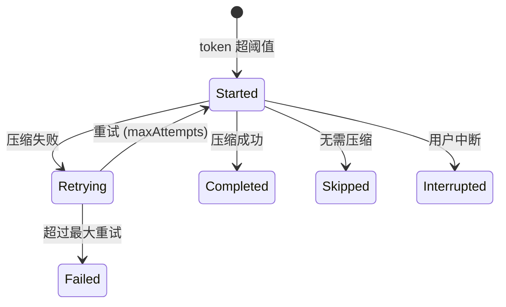
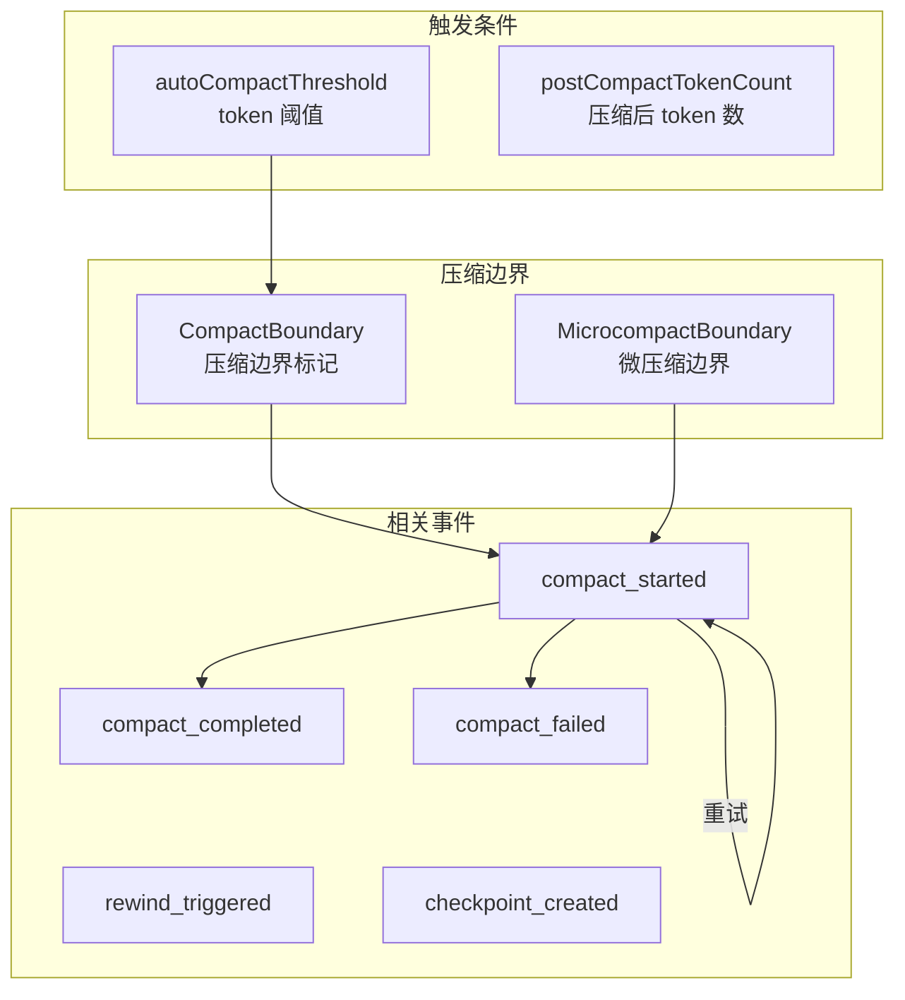
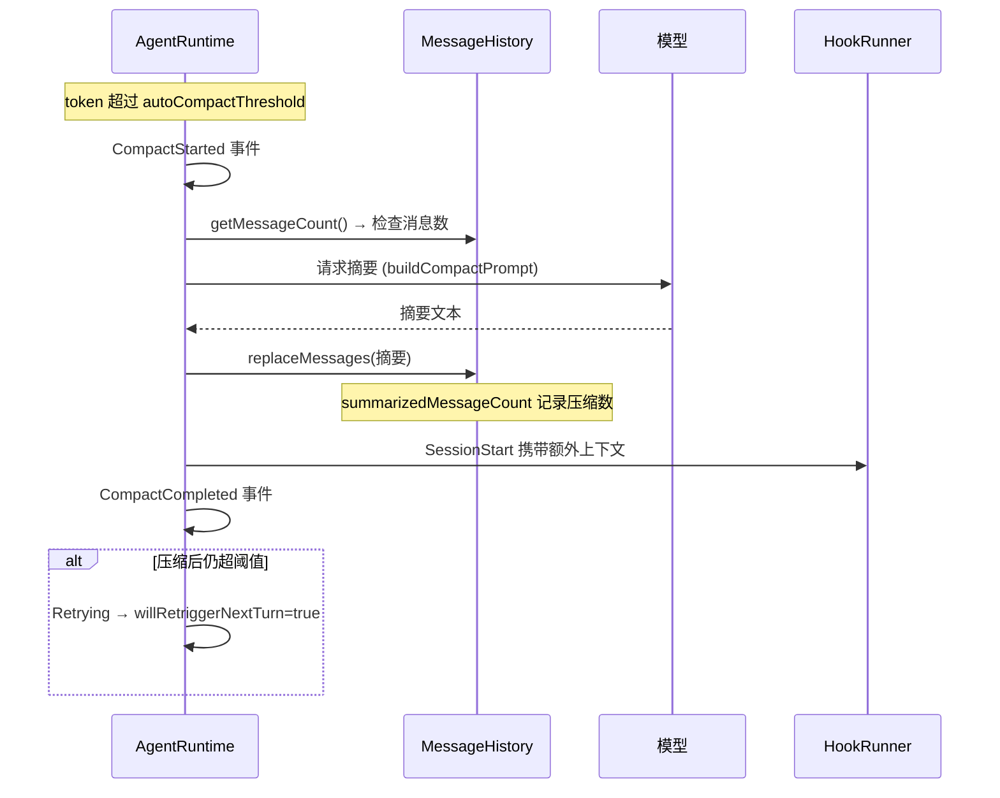
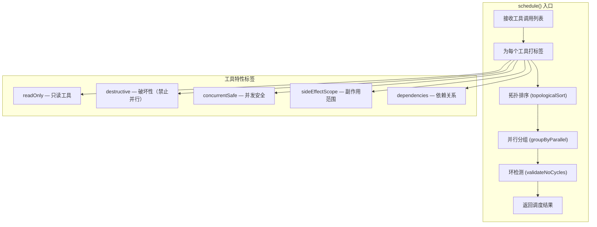

# 上下文管理与消息历史

> AgentRuntime 的上下文压缩（compact）机制和消息历史（MessageHistory）管理的完整设计。

---

## 一、MessageHistory（消息历史）

### 类结构

```javascript
// source: zcode.cjs — MessageHistoryImpl
class MessageHistory {
    entries = [];                          // 消息条目列表
    cacheStats = {                          // 缓存统计
        totalMessages: 0,                   // 总消息数
        cachedMessages: 0,                  // 已缓存消息数
        lastCacheHit: false                 // 上次是否命中缓存
    };
    lastModelCallIndex = 0;                 // 上次模型调用位置
}
```

### 14 个方法

| 方法 | 作用 |
|------|------|
| `init(systemPrompt)` | 初始化历史，可带系统提示 |
| `addUser(content, metadata)` | 添加用户消息 |
| `addAssistant(content, toolCalls, parts)` | 添加助手消息（含工具调用声明） |
| `addToolResult(toolCallId, toolName, content, isError)` | 添加工具结果 |
| `toModelMessages()` | 转成模型 API 格式 |
| `toRuntimeEntries()` | 转成运行时条目 |
| `replaceMessages(entries)` | 整体替换消息（压缩后） |
| `getMessageCount()` | 消息数量 |
| `getCacheStats()` | 缓存统计 |
| `setCacheHit(tokens)` | 标记缓存命中 |
| `setCacheMiss()` | 标记缓存未命中 |
| `getCacheableMessages()` | 可缓存的消息 |
| `getIncrementalMessages()` | 增量消息（用于追加缓存） |
| `reset()` | 重置历史 |

### 消息条目格式

```javascript
// 条目标签
const runtimeEntry = {
    message: { role: "user" | "assistant" | "tool", content: ... },
    metadata: {
        // 追加时间、来源、跟踪信息
    }
};
```

| 角色 | 内容 | 特殊字段 |
|------|------|----------|
| `system` | 系统提示文本 | — |
| `user` | 用户文本 | metadata |
| `assistant` | 文本 + tools + content parts | toolCalls: `[{id, name, input}]` |
| `tool` | 工具结果文本 | toolCallId, toolName, isError |

---

## 二、上下文压缩（Compact）

### 状态机



```javascript
// source: zcode.cjs — compact 状态枚举
const COMPACT_STATE = {
    Started: "started",
    Retrying: "retrying",
    Skipped: "skipped",
    Completed: "completed",
    Failed: "failed",
    Interrupted: "interrupted"
};
```

### 压缩触发与边界



### 压缩参数 Schema

```javascript
// source: zcode.cjs — compact 结果 schema
{
    postCompactTokenCount: number?,         // 压缩后 token 数
    truePostCompactTokenCount: number?,
    autoCompactThreshold: number?,          // 自动压缩阈值
    willRetriggerNextTurn: boolean?,        // 下一轮是否再次触发
    summarizedMessageCount: number,         // 被压缩的消息数
    keptMessageCount: number?,              // 保留的消息数
    lastSummarizedMessageId: string?,       // 最后压缩的消息 ID
    preservedSegment: segment?,             // 保留的特殊片段
    summaryMessageIds: string[],            // 摘要消息 ID 列表
    attachmentMessageIds: string[]?,        // 附件消息 ID
    hookResultMessageIds: string[],         // Hook 结果消息 ID
}
```

### 压缩对话流



---

## 三、ToolScheduler（工具调度器）

```javascript
// source: zcode.cjs — ToolScheduler
class ToolScheduler {
    itemsMap = new Map();      // toolCallId → 工具项
    maxConcurrency = 并发上限;
    readOnlyTools = 只读工具集合;
}
```

### 调度算法



### 并行判定逻辑

```javascript
function canRunInParallel(tool) {
    // 无名称且无特性的工具 → 可并行
    if (!tool.toolName && !hasFlags(tool)) return true;
    
    // 破坏性工具 → 禁止并行
    if (tool.destructive) return false;
    
    return true;  // 只读 / 并发安全 / sideEffectScope=none
}
```

### 拓扑排序

```javascript
function topologicalSort(tools) {
    // 计算每个工具的入度（依赖数）
    let indegree = new Map(tools.map(t => [t.toolCallId, t.dependencies.length]));
    
    // 从无依赖的工具开始
    let queue = tools.filter(t => t.dependencies.length === 0);
    let sorted = [];
    
    while (queue.length > 0) {
        let current = queue.shift();
        sorted.push(current);
        // 减少依赖它的工具的入度
        for (let dep of tools) {
            if (dep.dependencies.includes(current.toolCallId)) {
                indegree.decrement(dep.toolCallId);
                if (indegree.get(dep.toolCallId) === 0) {
                    queue.push(dep);
                }
            }
        }
    }
    // 循环依赖检测
    if (sorted.length < tools.length) {
        throw new Error("Circular dependency detected");
    }
    return sorted;
}
```

### 调度结果

```javascript
{
    items: [...],          // 所有工具项
    parallelGroups: [      // 并行分组（组内可并行）
        ["read_file", "grep"],      // 第 1 组
        ["bash"],                   // 第 2 组（破坏性）
        ["write_file"],            // 第 3 组
    ],
    executionOrder: [...], // 完整执行顺序
}
```

---

## 四、关联事件

| 事件 | 说明 |
|------|------|
| `compact_started` | 压缩开始 |
| `compact_completed` | 压缩完成 |
| `compact_failed` | 压缩失败 |
| `compact_boundary` | 压缩边界 |
| `microcompact_boundary` | 微压缩边界 |
| `rewind_triggered` | 回滚触发 |
| `checkpoint_created` | 检查点创建 |

---

## 关键代码索引

| 模块 | 位置 | 说明 |
|------|------|------|
| `MessageHistoryImpl` | zcode.cjs | 消息历史实现 (14 方法) |
| `ToolScheduler` | zcode.cjs | 工具调度器 (拓扑排序 + 并行分组) |
| `autoCompactThreshold` | zcode.cjs | 自动压缩阈值 |
| Compact schema | zcode.cjs | 压缩结果参数 |
| `buildCompactPrompt` | zcode.cjs | 压缩提示构建 |
| `canRunInParallel` | zcode.cjs | 并行判定 |
| `topologicalSort` | zcode.cjs | 依赖拓扑排序 |
| `groupByParallel` | zcode.cjs | 并行分组 |