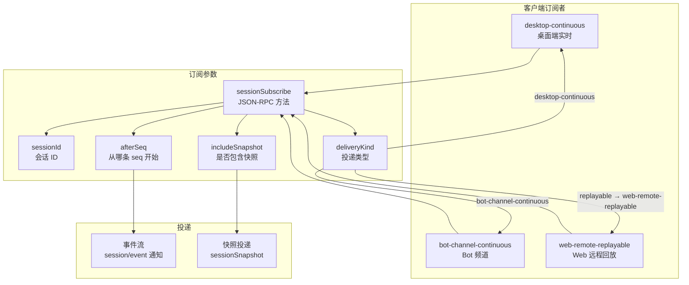
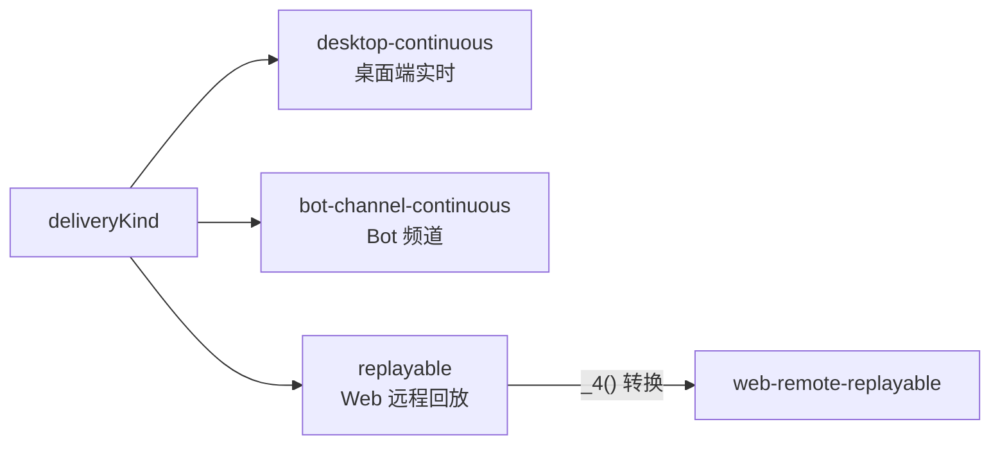
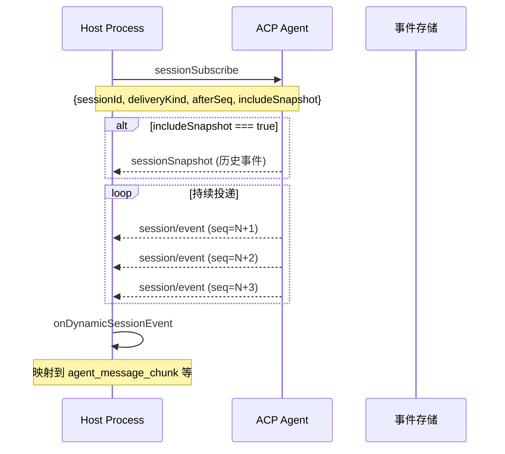
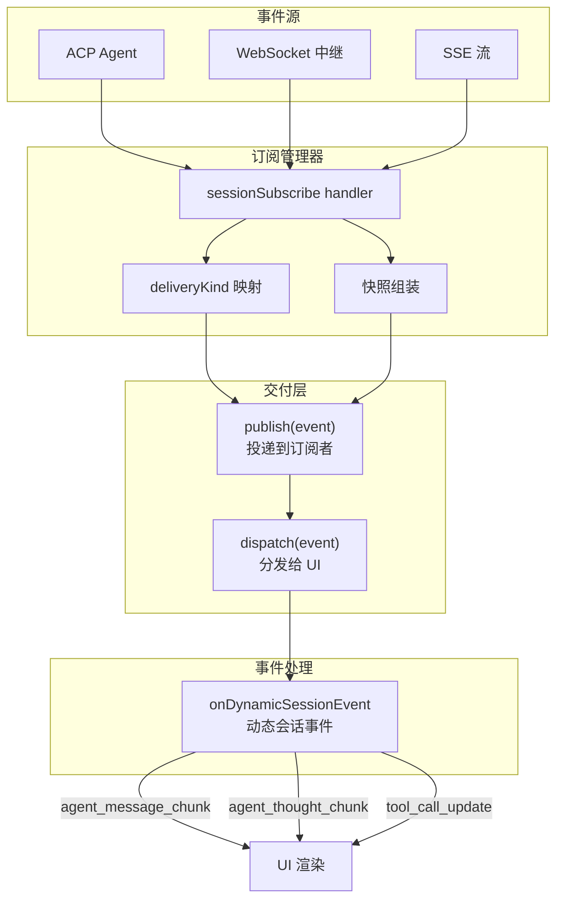
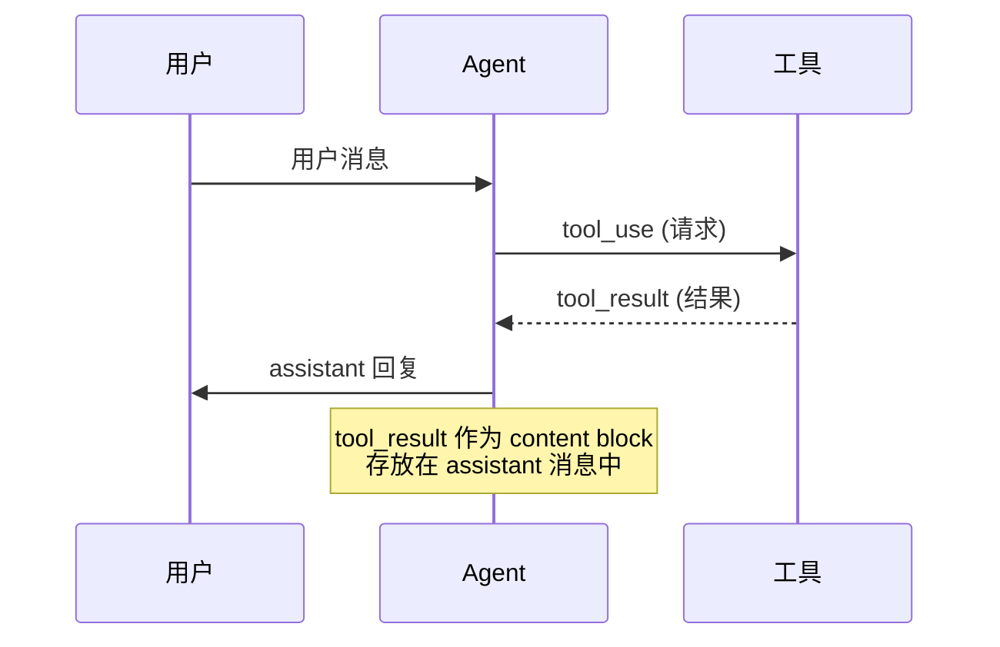
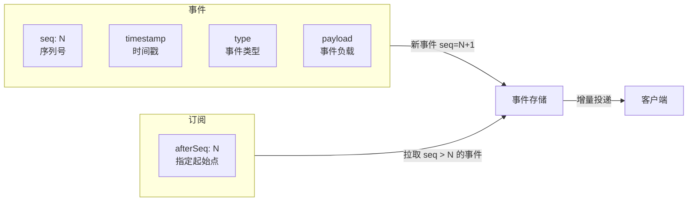

# 事件流订阅与投递机制

> 实时事件流订阅 (`sessionSubscribe`) 和 `tool_result` 事件格式分析。

---

## 事件订阅架构



---

## 订阅参数

```javascript
// source: host/index.js — sessionSubscribe 调用
{
    sessionId: "sess_xxx",               // 要订阅的会话 ID
    deliveryKind: "desktop-continuous",  // 投递类型
    afterSeq: 42,                        // 从哪条序列号之后开始接收
    includeSnapshot: true                // 是否包含历史快照
}
```

### DeliveryKind 枚举



| 值 | 用途 | 说明 |
|------|------|------|
| `desktop-continuous` | 桌面端 | 默认值，实时流式投递 |
| `bot-channel-continuous` | Bot | 机器人频道持续投递 |
| `replayable` | Web 远程 | 客户端代码中映射为 `web-remote-replayable` |

```javascript
// source: host/index.js — _4 (toZCodeDeliveryKind)
function _4(deliveryKind) {
    return deliveryKind === "replayable"
        ? "web-remote-replayable"
        : "desktop-continuous";
}
```

---

## 订阅生命周期



---

## 事件交付驱动



---

## tool_result 事件

`tool_result` 在代码中作为 content block 类型出现，属于 **Anthropic Messages API 的 content 数组**：

```javascript
// source: zcode.cjs — 事件类型注册
{
    tool_result_warning: "tool_result",  // 事件名映射
    // 在 mid_turn_event 时触发
}
```

在处理对话历史时，`tool_result` 类型的 content block 会被**跳过**（不参与用户文本提取）：

```javascript
// source: host/index.js
function extractUserText(parts) {
    return parts.flatMap(part => {
        if (typeof part === "string") return [part];
        if (!isObject(part) || part.type === "tool_result") return [];  // ← 跳过
        // ...
    });
}
```

### tool_result 在消息中的位置



### 消息结构示例

```json
{
    "role": "assistant",
    "content": [
        {
            "type": "tool_use",
            "id": "toolu_xxx",
            "name": "bash",
            "input": {"command": "ls"}
        },
        {
            "type": "text",
            "text": "执行完成"
        },
        {
            "type": "tool_result",  // ← 工具执行结果
            "tool_use_id": "toolu_xxx",
            "content": "file1.txt  file2.txt"
        }
    ]
}
```

---

## 事件序列号机制



| 参数 | 说明 |
|------|------|
| `seq` | 单调递增序列号，用于断点续传 |
| `afterSeq` | 订阅时指定，只接收该序列号之后的事件 |
| `includeSnapshot` | 是否先接收当前全量快照，再进入增量模式 |

---

## 关键代码索引

| 函数/变量 | 位置 | 说明 |
|-----------|------|------|
| `Ie.sessionSubscribe` | host/index.js | JSON-RPC 方法名 |
| `_4()` | host/index.js | `deliveryKind` 映射 |
| `onDynamicSessionEvent()` | host/index.js | 事件分发处理 |
| `deliveryKind` 枚举 | 多处 | `desktop-continuous` / `replayable` |
| `includeSnapshot` | host/index.js | 快照标志 |
| `publish()` | host/index.js | 事件投递 |
| `tool_result` | zcode.cjs | content block 类型 |