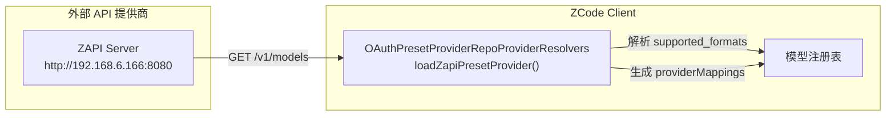
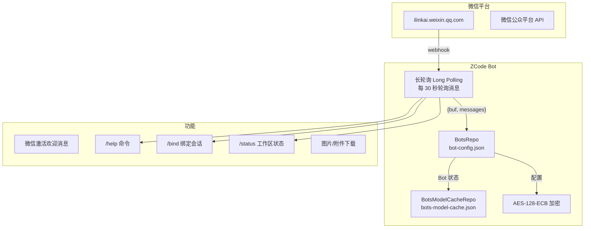
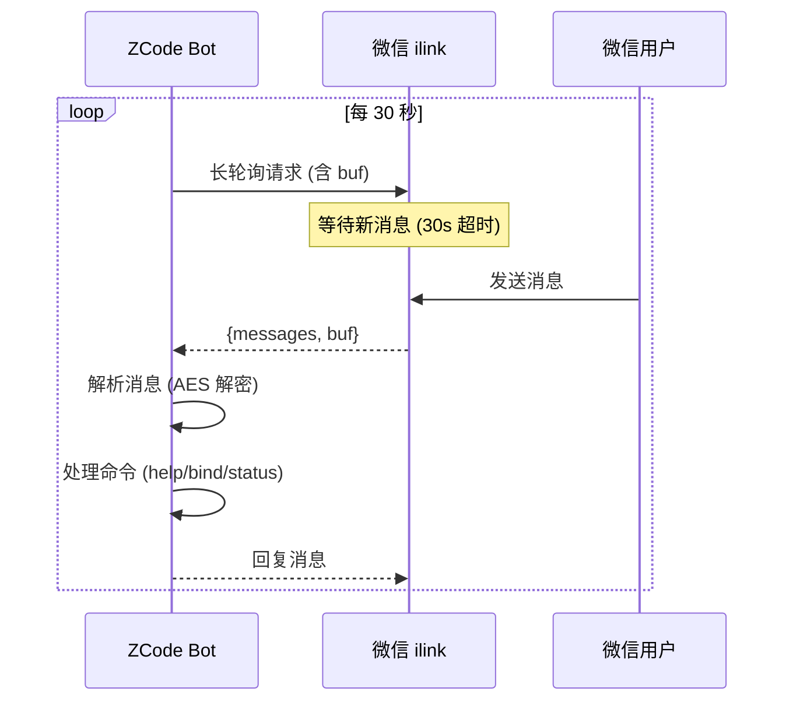

# 集成子系统：ZAPI / WeChat Bot / Doc 生成器

---

## ZAPI — 动态提供商发现

### 架构



### URL 配置

| 用途 | URL |
|------|-----|
| ZAPI Base | `http://192.168.6.166:8080`（开发环境） |
| 模型列表 | `GET /v1/models` |
| BigModel 业务 | `POST /api/biz/customer/getCustomerInfo` |
| 组织项目 | `GET /api/biz/v1/organization/{orgId}/projects/{projectId}/api_keys` |

### 动态提供商解析流程

```javascript
async function loadZapiPresetProvider() {
    // 1. 从 ZAPI 获取模型列表
    let models = await fetch(`${zapiBase}/v1/models`);
    let modelIds = models.map(m => m.id).filter(id => id !== "auto");
    
    // 2. 解析格式支持
    let modelFormats = {};
    models.forEach(m => {
        let formats = parseSupportedFormats(m.supported_formats);
        if (formats.length > 0) modelFormats[m.id] = formats;
    });
    
    // 3. 构建提供商配置
    return {
        id: "zapi",
        name: "ZAPI",
        endpoints: {
            baseURL: "http://192.168.6.166:8080",
            paths: { anthropic: "/v1/messages" }
        },
        models: modelIds,
        modelSupportedFormats: modelFormats,
        providerMappings: {
            claude: { haiku: modelIds[0], sonnet: modelIds[0], opus: modelIds[0] }
        }
    };
}
```

### API Key 自动注册

```javascript
async function resolveBizApiKey(baseUrl, authHeader, options) {
    // 1. 获取客户信息 → 组织 ID → 项目 ID
    let customerInfo = await fetch(`${baseUrl}/api/biz/customer/getCustomerInfo`, {
        headers: { Authorization: authHeader }
    });
    
    // 2. 查找或创建 API key
    let apiKeysUrl = `${baseUrl}/api/biz/v1/organization/${orgId}/projects/${projectId}/api_keys`;
    let key = await findOrCreateApiKey(apiKeysUrl, "zcode");
    
    // 3. 获取 secretKey
    let secretKey = await fetch(`${apiKeysUrl}/copy/${key.apiKey}`);
    return `${key.apiKey}.${secretKey}`;
}
```

---

## WeChat Bot 集成



### 配置

| 项 | 值 |
|----|-----|
| 平台 | `ilinkai.weixin.qq.com` |
| 协议版本 | `2.0.0` |
| 消息版本 | `2` |
| 加密 | `AES-128-ECB` |
| 超时 | `30 秒` |
| 轮询间隔 | `30 秒` |
| 等待队列 | `120 条` |

### 状态文件

| 文件 | 说明 |
|------|------|
| `{dataDir}/bot-config.json` | Bot 配置（微信号绑定等） |
| `{dataDir}/bot-state.json` | Bot 运行状态 |
| `{dataDir}/bot-state.v2.json` | Bot 状态 v2 |
| `{dataDir}/bots-model-cache.json` | 模型缓存 |
| `{dataDir}/bots-model-cache.v2.json` | 模型缓存 v2 |

### 长轮询机制



### 消息格式

```javascript
// 轮询请求
{
    botId: "bot_xxx",
    messages: [{
        id: "msg_id",
        text: "你好",
        from: "weixin_user_id",
        chatId: "chat_id",
        displayName: "用户昵称",
        context_token: "token",
        attachments: []  // 图片等附件
    }],
    buf: "..."  // 轮询游标
}

// 附件解密
{
    filename: "weixin-image-1.jpg",
    kind: "image",
    mimeType: "image/jpeg",
    dataBase64: "...",
    providerMetadata: {
        weixinAesKey: "aes_key"  // AES-128-ECB key
    }
}
```

### 支持的命令

| 命令 | 说明 |
|------|------|
| `/bind <code>` | 绑定微信聊天到工作区 |
| `/status` | 查看工作区、模型、任务状态 |
| `/help` | 帮助信息 |
| 直接描述 | 直接描述任务 → AI 处理 |

---

## Doc — 代码生成器

结构化设置文件的运行时生成器，支持缩进管理和动态函数编译：

```javascript
class Doc {
    constructor(args = []) {
        this.content = [];
        this.indent = 0;
        this.args = args;
    }
    
    // 缩进执行代码块
    indented(callback) {
        this.indent += 1;
        callback(this);
        this.indent -= 1;
    }
    
    // 写入内容（自动处理缩进）
    write(content) {
        if (typeof content === "function") {
            // 同步 + 异步两次执行
            content(this, { execution: "sync" });
            content(this, { execution: "async" });
            return;
        }
        // 自动去除公共缩进后重新缩进
        let lines = content.split("\n").filter(l => l);
        let minIndent = Math.min(...lines.map(l => l.length - l.trimStart().length));
        let formatted = lines.map(l => " ".repeat(this.indent * 2) + l.slice(minIndent));
        this.content.push(...formatted);
    }
    
    // 编译为可执行函数
    compile() {
        let body = this.content.map(line => `  ${line}`).join("\n");
        return new Function(...this.args, body);
    }
}
```

---

## 未归档类总表

| 类 | 已分析？ | 说明 |
|---|----------|------|
| ZAPI 动态提供商 | ✅ **新分析** | 运行时发现模型列表 |
| WeChat Bot | ✅ **新分析** | 微信长轮询集成 |
| Doc 代码生成器 | ✅ **新分析** | 结构化函数生成 |
| OAuthPresetProviderRepoProviderResolvers | ✅ **已覆盖** | ZAPI 解析器 |
| OAuthPresetProviderRepoRemoteClient | ⚠️ 小工具 | 远程配置获取 |
| `*Error` 类 (5个) | ❌ 纯错误类 | 无分析价值 |