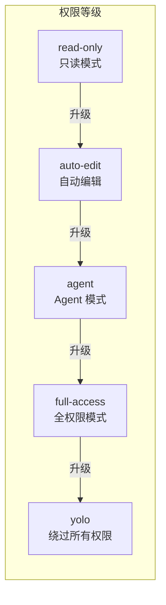
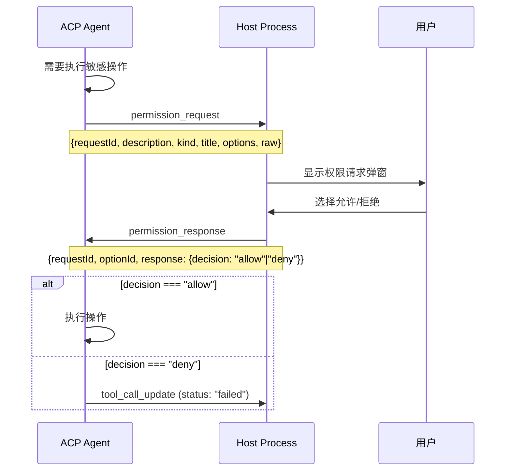
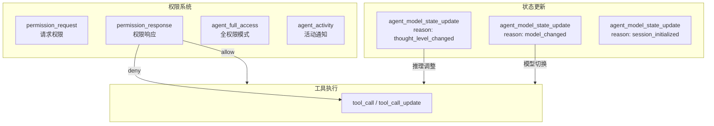

# 权限模式与模型状态变更协议

> Agent 权限模式 (`agent_full_access` / `agent_activity`) 和模型状态变更 (`agent_model_state_update`) 协议分析。

---

## 权限模式体系

### 模式等级



### 模式映射

```javascript
// source: host/index.js — BA (normalizeModeToPermissionLevel)
function normalizeModeToPermissionLevel(mode, platform) {
    switch(mode) {
        // 只读模式
        case "read-only":
        case "read_only":
            return "plan";

        // 自动编辑
        case "auto_edit":
        case "auto-edit":
        case "autoEdit":
        case "accept_edits":
            return "autoEdit";

        // Agent 模式
        case "agent":
            return platform === "codex" ? "default" : undefined;

        // 全权限模式
        case "agent-full-access":
        case "agent_full_access":
        case "full-access":
        case "full_access":
            return "bypassPermissions";

        // 完全绕过
        case "yolo":
        case "bypassPermissions":
        case "dontAsk":
            return "yolo";

        // 预设方案
        case "plan":   return "plan";
        case "build":  return "plan";
        case "auto":   return "auto";
    }
}
```

### 模式与事件关系

| 模式 | 内部值 | 说明 |
|------|--------|------|
| `read-only` | `plan` | 只能读文件，不能修改 |
| `auto-edit` | `autoEdit` | 自动编辑已存在的文件 |
| `agent` | `default` / 空 | 标准 Agent 模式 |
| `full-access` | `bypassPermissions` | 完整权限，会弹权限请求 |
| `yolo` | `yolo` | 绕过所有权限确认，完全自动 |

---

## agent_full_access 事件

当用户切换到 `full-access` 模式时，Agent 发出该事件：

```javascript
{
    type: "agent_full_access",
    // 无额外 payload，纯信号事件
}
```

---

## 权限请求协议



### permission_request payload

```javascript
{
    type: "permission_request",
    taskId: "task_xxx",
    traceId: "...",
    requestId: "req_xxx",
    description: "执行命令: rm -rf /",
    kind: "bash",            // 工具类型: bash / file / command
    title: "Bash",           // 显示标题
    options: ["allow", "deny", "allowOnce"],  // 可用选项
    raw: { ... }             // 原始请求数据
}
```

### permission_response payload

```javascript
{
    type: "permission_response",
    taskId: "task_xxx",
    traceId: "...",
    requestId: "req_xxx",
    optionId: "allow",
    response: {
        decision: "allow"    // "allow" | "deny"
    }
}
```

### 权限响应 → tool_call_update 联动

当用户拒绝时，Host 不仅回复 `permission_response`，还会发送 `tool_call_update`：

```javascript
// 批准时
[{ type: "permission_response", decision: "allow" }]

// 拒绝时
[
    { type: "permission_response", decision: "deny" },
    { type: "tool_call_update", status: "failed", error: "..." }
]
```

---

## agent_model_state_update 事件

当 Agent 的模型或推理级别发生变化时发出：

```javascript
// source: host/index.js — agent_model_state_update dispatch
{
    type: "agent_model_state_update",     // 注意：可能前缀为 glm_
    taskId: "task_xxx",
    traceId: "...",
    version: 1,
    sessionId: "task_xxx",
    reason: "thought_level_changed"       // 变更原因
        | "model_changed"                 // 模型切换
        | "session_initialized",          // 会话初始化
    model: {
        currentValue: "glm-5.1"           // 当前模型
    },
    thoughtLevel: {
        enabled: true,                    // 是否启用推理
        budgetTokens: 2048                // 推理 token 预算
    }
}
```

### reason 枚举

| 值 | 说明 |
|------|------|
| `thought_level_changed` | 推理层级变更（开关/预算调整） |
| `model_changed` | 模型切换（如从 GLM-5.1 切到 GLM-5-Turbo） |
| `session_initialized` | 会话首次初始化 |

---

## agent_activity 事件

Agent 的结构化活动通知（含 thought 字段）：

```javascript
// source: host/index.js — Q4 (parseAgentActivityResultContent)
{
    kind: "agent_activity",
    content: "...",           // 活动描述文本
    thought: "..."            // 可选，Agent 的思考过程
}
```

解析逻辑：

```javascript
function Q4(agentType, rawContent) {
    // 1. 解析 JSON
    let parsed = parseJSON(rawContent);
    if (!parsed) return null;

    // 2. 验证 agentId / agentType
    if (agentType !== "Agent" && !parsed.agentId && !parsed.agentType)
        return null;

    // 3. 提取 content
    let content = extractText(parsed.content);
    if (!content) return null;

    // 4. 提取 thought
    let thought = parsed.thought;

    return {
        kind: "agent_activity",
        content: content,
        ...(thought ? { thought } : {})
    };
}
```

---

## 事件关系总览



---

## API 端点

### 支付相关（本轮发现的）

| 端点 | 方法 | 说明 |
|------|------|------|
| `/pay/create-sign` | POST | 支付宝/微信支付签名 |
| `/pay/check` | GET | 查询支付状态 |
| `/stripe/query` | GET | 查询 Stripe 已绑卡 |
| `/stripe/bind` | POST | Stripe 绑卡 |
| `/stripe/pay` | POST | Stripe 支付/订阅 |
| `/paypal/isSupport` | GET | PayPal 可用性 |
| `/paypal/setupToken` | POST | PayPal 授权 token |
| `/paypal/subscribe` | POST | PayPal 订阅 |

---

## 关键代码索引

| 函数 | 位置 | 说明 |
|------|------|------|
| `BA()` | host/index.js | 权限等级归一化 |
| `Q4()` | host/index.js | agent_activity 解析 |
| `permissionRequestToStreamEvent()` | host/index.js | n6, r6 函数 |
| `permission_response` dispatch | host/index.js | 权限响应处理 |
| `glm_agent_model_state_update` | host/index.js | 模型状态变更事件 |
| `normalizeModeToPermissionLevel()` | host/index.js | 模式→等级映射 |