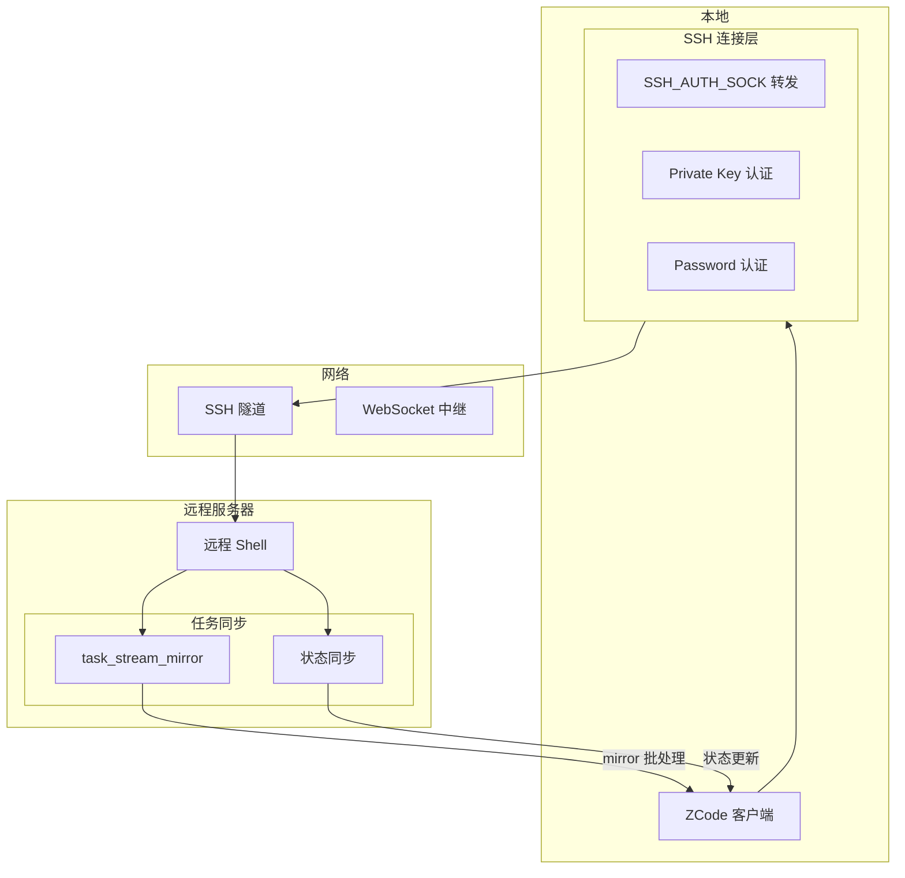
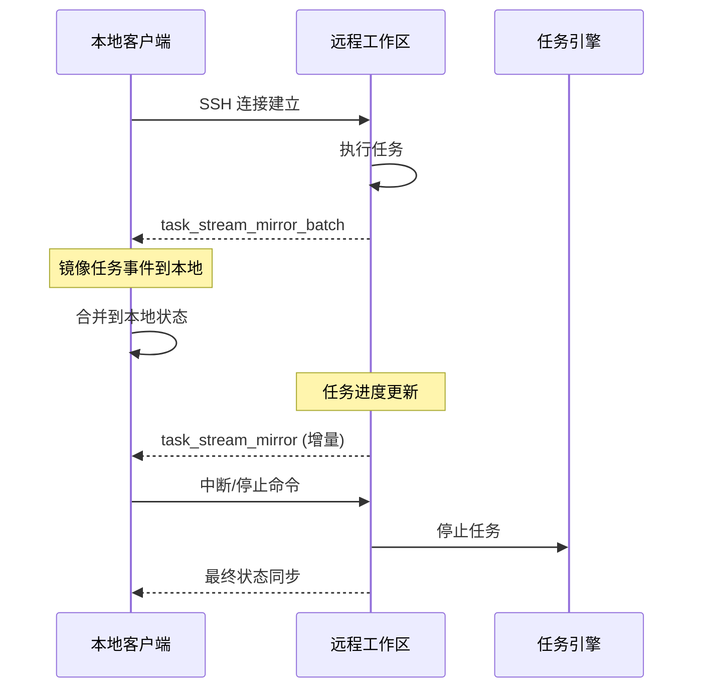

# 远程工作区协议

> SSH 远程工作区连接与任务同步协议分析。

---

## 远程工作区架构



---

## SSH 连接配置

```javascript
// source: host/index.js
{
    kind: "ssh",
    host: "192.168.1.100",
    port: 22,
    username: "user",
    privateKeyPath: "/path/to/key",
    passwordCredentialKey: "ssh:password:ref"  // 可选，从加密存储读取
}
```

### 环境变量白名单

SSH 会话中透传的环境变量：

| 变量 | 说明 |
|------|------|
| `SSH_AUTH_SOCK` | SSH 认证 socket 转发 |
| `AWS_PROFILE`, `AWS_REGION` | AWS 凭证 |
| `GOOGLE_APPLICATION_CREDENTIALS` | GCP 凭证 |
| `LANG`, `LC_*` | 本地化设置 |
| `TERM`, `COLORTERM` | 终端类型 |
| `XDG_CONFIG_HOME`, `XDG_DATA_HOME` | 用户配置路径 |
| `NPM_*` | Node.js 环境 |

---

## 任务同步机制

### 任务流镜像批处理



---

## 协议要点

| 特性 | 说明 |
|------|------|
| 传输协议 | SSH (libssh2) |
| 认证方式 | Private Key / Password |
| 环境透传 | 白名单机制 |
| 任务同步 | `task_stream_mirror_batch` 批处理 |
| 连接管理 | 自动重连 + session 恢复 |