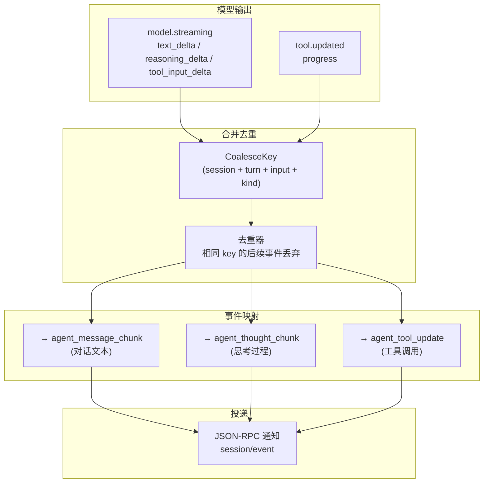
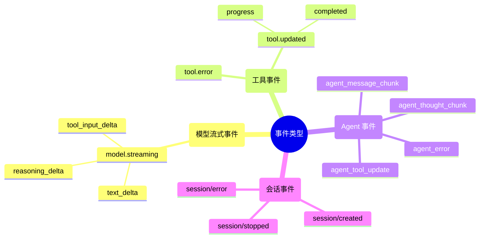
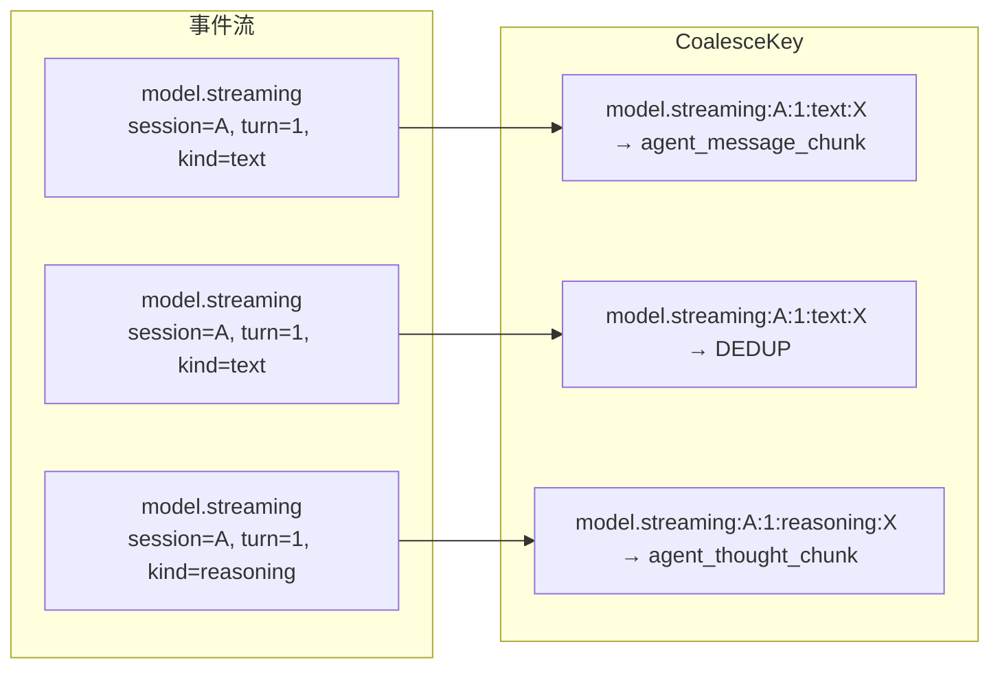
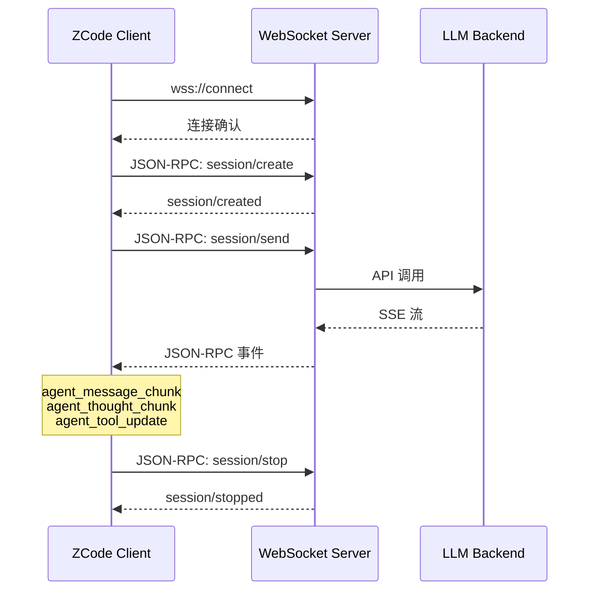
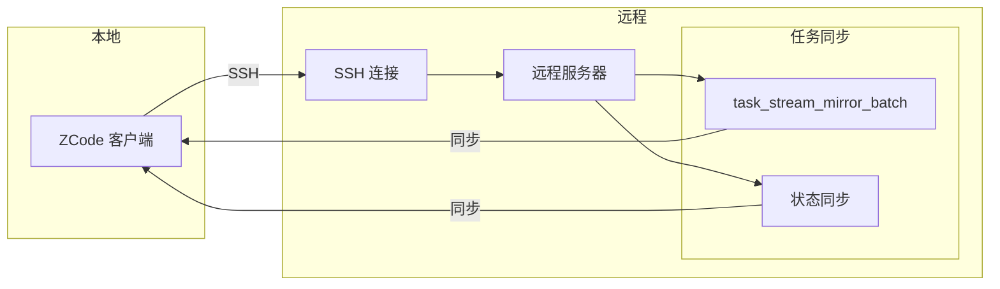

# WebSocket / 流式管道

> ZCode 的事件流式处理管道，从模型流式输出到 Agent 事件的完整转换链。

---

## 事件转换管道



---

## JSON-RPC 协议

ZCode 使用 JSON-RPC 2.0 作为 Agent ↔ Host 之间的通信协议。

### 请求格式

```json
{
    "id": 1,
    "method": "session/send",
    "params": {
        "message": "帮我写一个 Python 脚本"
    },
    "trace": {
        "traceId": "abc123"
    }
}
```

### 响应格式

```json
{
    "id": 1,
    "result": {
        "sessionId": "sess_xxx",
        "status": "processing"
    }
}
```

### 错误响应

```json
{
    "id": 1,
    "error": {
        "code": -32602,
        "message": "Invalid params",
        "data": { ... }
    }
}
```

### 通知（无需响应）

```json
{
    "method": "session/event",
    "params": {
        "type": "agent_message_chunk",
        "payload": {
            "text": "Hello!"
        }
    }
}
```

---

## 事件类型



---

## 去重逻辑

ZCode 使用 CoalesceKey 机制合并重复的流式事件：



```javascript
function getCoalesceKey(event) {
    if (event.type === "model.streaming") {
        const kind = event.payload.kind;
        return `${event.type}:${sessionId}:${turnId}:${kind}:${inputId}`;
    }
    if (event.type === "tool.updated" && kind === "progress") {
        return `${event.type}:${sessionId}:${toolCallId}`;
    }
}
```

---

## WebSocket 连接



---

## 远程工作区

ZCode 支持通过 SSH 连接远程工作区：

