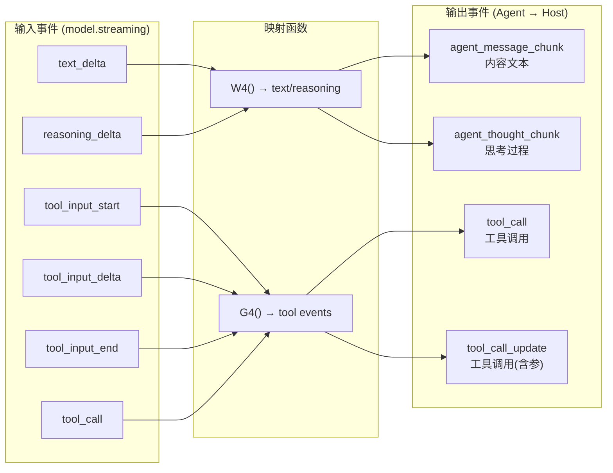
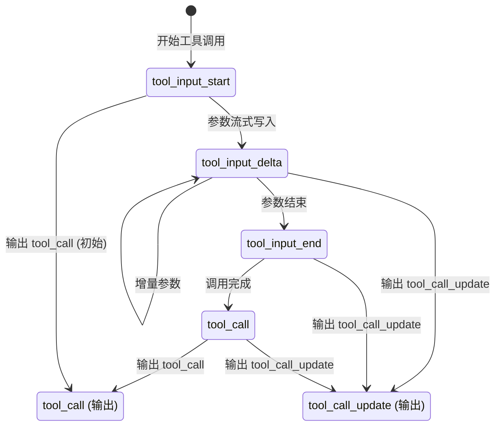
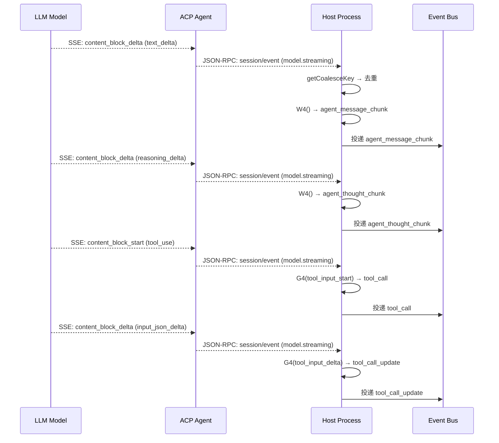

# WebSocket / 流式管道深度分析

> 事件流式处理管道 — 从模型流式输出到 Agent 事件的完整转换链。

---

## 事件转换总览



---

## 核心映射函数

### W4() — 文本/推理事件映射

```javascript
// source: host/index.js
function W4(taskId, traceId, inputId, payload, toolNameMap, toolInputMap) {
    let kind = payload.kind;       // "text_delta" | "reasoning_delta"
    let content = payload.delta;
    let parentToolUseId = payload.parentToolUseId;

    if (kind === "text_delta" && content) {
        return {
            type: "agent_message_chunk",
            taskId, traceId, inputId,
            parentToolUseId,
            messageId: payload.assistantMessageId,
            content: content
        };
    }

    if (kind === "reasoning_delta" && content) {
        return {
            type: "agent_thought_chunk",
            taskId, traceId, inputId,
            parentToolUseId,
            content: content
        };
    }

    // 其他类型 → 交给 G4() 处理
    return G4(taskId, traceId, inputId, payload, toolNameMap, toolInputMap);
}
```

### G4() — 工具调用事件映射

G4 处理 4 种子事件：



核心逻辑（简化）：

```javascript
function G4(taskId, traceId, inputId, payload, toolNameMap, toolInputMap) {
    let kind = payload.kind;
    let toolCallId = payload.toolCallId;
    if (!toolCallId) return null;

    let toolName = payload.toolName || toolNameMap.get(toolCallId);

    if (kind === "tool_input_start") {
        // 初始化工具调用
        toolInputMap.set(toolCallId, { rawInput: "" });
        return {
            type: "tool_call",
            taskId, traceId, toolId: toolCallId,
            toolName, input: {}, kind: toolName || "tool",
            ...
        };
    }

    if (kind === "tool_input_delta") {
        // 增量写入工具参数
        let state = toolInputMap.get(toolCallId);
        state.rawInput += payload.delta || "";
        if (!isReadyToParse(state)) return null;  // 跳过感知前小片段
        let parsed = parseInput(state.rawInput);
        return {
            type: "tool_call_update",
            status: "pending",
            toolId: toolCallId,
            input: parsed.input,
            ...
        };
    }

    if (kind === "tool_input_end" || kind === "tool_call") {
        // 工具参数完成
        let rawInput = toolInputMap.get(toolCallId)?.rawInput || "";
        return {
            type: "tool_call_update",
            status: "pending",
            toolId: toolCallId,
            input: parsed.input,
            ...
        };
    }
}
```

### H4() — 非流式消息回放

用于已完成的 AI 响应回放（非流式消息）：

```javascript
function H4(taskId, traceId, inputId, payload) {
    let part = payload.part;
    if (part.type !== "text") return null;

    let timeline = extractForkTimeline(part.metadata);
    if (!timeline) return null;

    return {
        type: "agent_message_chunk",
        taskId, traceId, inputId,
        messageId: part.messageId || payload.messageId,
        content: part.text || "",
        zcodeTimeline: timeline
    };
}
```

---

## 事件类型汇总

| 事件类型 | 来源 | 说明 |
|----------|------|------|
| `agent_message_chunk` | W4/H4 | AI 回复的文本片段 |
| `agent_thought_chunk` | W4 | 推理过程文本片段 |
| `agent_activity` | ? | Agent 活动状态 |
| `agent_full_access` | ? | 完全访问模式 |
| `agent_model_state_update` | ? | 模型状态更新 |
| `tool_call` | G4 | 工具调用初始 |
| `tool_call_update` | G4 | 工具调用(带参数) |

---

## 事件去重机制

```javascript
// source: host/index.js — getCoalesceKey
function getCoalesceKey(event) {
    if (event.type === "model.streaming") {
        const kind = event.payload.kind;
        return `${event.type}:${sessionId}:${turnId}:${kind}:${inputId}`;
    }
    if (event.type === "tool.updated" && kind === "progress") {
        return `${event.type}:${sessionId}:${toolCallId}`;
    }
}
```

当多个相同的 `model.streaming:text_delta:sessionX:turnY:inputZ` 到达时，只有第一个被转换，后续的被丢弃。

---

## 事件管道全貌



---

## 关键代码索引

| 函数 | 文件名 | 行范围 | 功能 |
|------|--------|--------|------|
| W4() | host/index.js | — | text_delta → agent_message_chunk |
| G4() | host/index.js | — | tool 事件 → tool_call/tool_call_update |
| H4() | host/index.js | — | 非流式回放映射 |
| OA() | host/index.js | — | forkContext 元数据解析 |
| getCoalesceKey | host/index.js | — | 事件合并去重 |