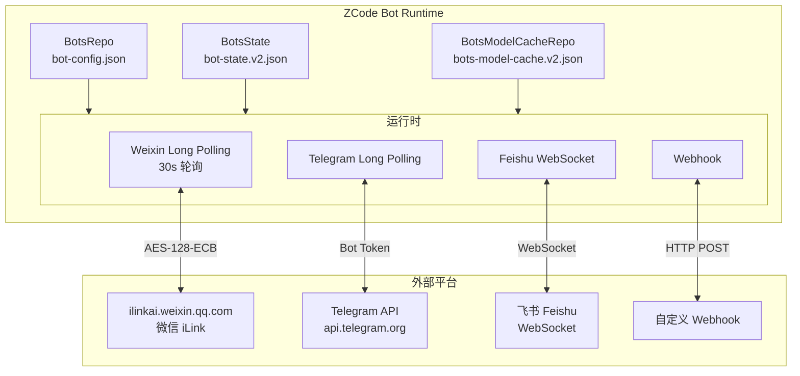
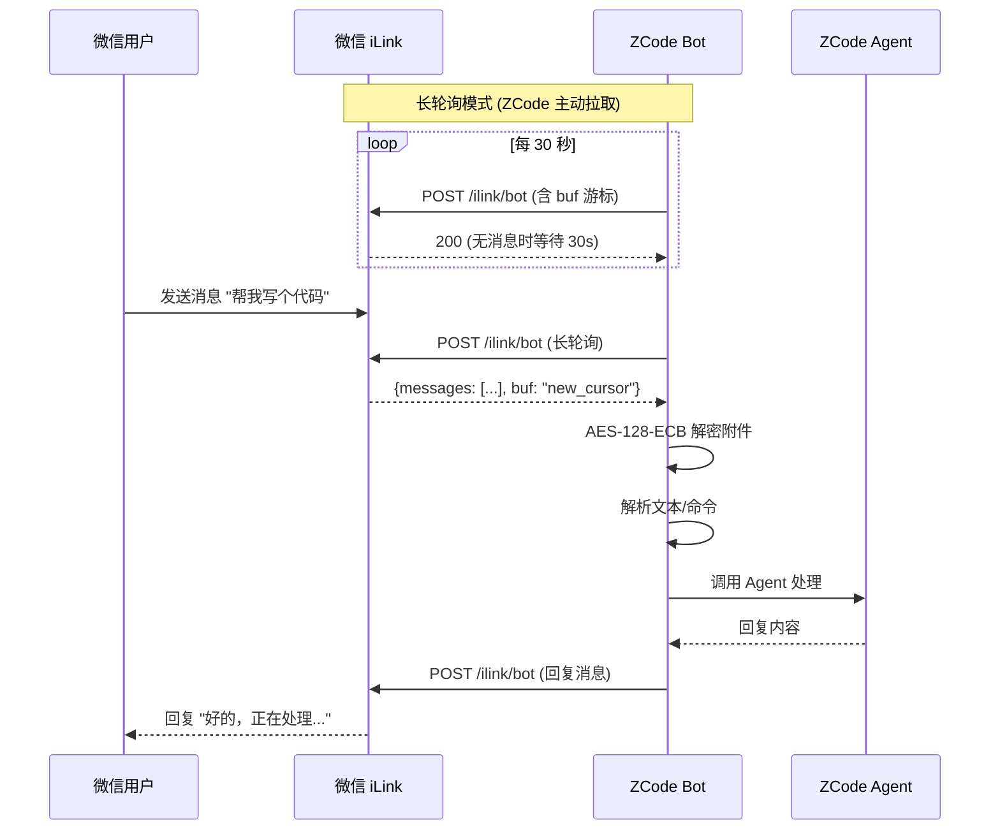
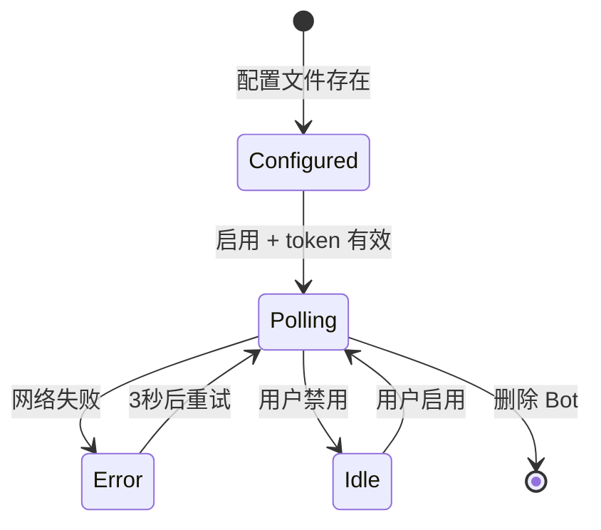
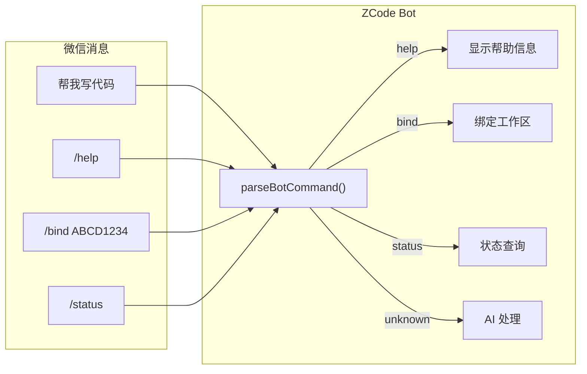

# WeChat Bot 集成深度分析

> ZCode 的微信 Bot 集成是通过 **ilink（iLink AI）** 平台实现的长轮询消息通道。

---

## 一、Bot 系统架构总览

ZCode 支持 **4 种 Bot 提供商**：



---

## 二、WeChat Bot 信令通道

### 2.1 通道参数

| 参数 | 值 | 说明 |
|------|-----|------|
| 平台 URL | `https://ilinkai.weixin.qq.com` | iLink AI 微信开放平台 |
| API 路径 | `/ilink/bot` | Bot 消息接口 |
| 协议版本 | `2.0.0` | iLink 协议版本 |
| 消息版本 | `2` | 消息格式版本 |
| 附件版本 | `2` | 附件格式版本 |
| 加密算法 | `AES-128-ECB` | 附件加密 |
| 轮询超时 | `30 秒` | 长轮询等待超时 |
| 错误重试 | `3 次` | 最多重试次数 |
| 消息队列 | `120 条` | 最大等待消息数 |

### 2.2 长轮询 vs 推送



---

## 三、消息格式详解

### 3.1 轮询请求

```javascript
// 每次轮询检查新消息
POST https://ilinkai.weixin.qq.com/ilink/bot
Headers: {
    "Authorization": "Bearer <weixin_bot_token>"
}

// 请求体
{
    "botId": "bot_xxx_123",             // Bot ID
    "messages": [{
        "id": "msg_001",                // 消息 ID
        "text": "帮我写个 Python 脚本",  // 消息文本
        "from": "weixin_user_abc",      // 发送用户 ID
        "chatId": "chat_group_xyz",     // 群聊/私聊 ID
        "displayName": "张三",           // 用户昵称
        "context_token": "ctx_token",   // 上下文 token
        "attachments": []               // 附件列表
    }],
    "buf": "cursor_abc_123"             // 轮询游标（增量标记）
}
```

### 3.2 消息解析

```javascript
// source: host/index.js — weixin 消息解析流程
// 文本消息 → 解析为 { botId, text, actor }
{
    botId: "bot_xxx",
    text: "/help",
    actor: {
        provider: "weixin",
        botId: "bot_xxx",
        providerUserId: "weixin_user_abc",
        displayName: "张三",
        chatType: "private" | "group",
        chatId: "chat_group_xyz",
        providerMessageId: "msg_001",
        providerContextToken: "ctx_token"  // 上下文标记
    }
}
```

### 3.3 附件格式

```javascript
// 附件对象 (图片等)
{
    id: "weixin-1",                    // 附件编号
    kind: "image",                     // 附件类型: image / file
    filename: "weixin-image-1.jpg",    // 文件名
    mimeType: "image/jpeg",            // MIME 类型
    sizeBytes: 102400,                 // 文件大小
    dataBase64: "...base64...",        // 文件数据 (Base64)
    providerMetadata: {
        weixinAesKey: "aes_key_here"   // AES-128-ECB 加密密钥
    }
}
```

附件使用 **AES-128-ECB** 加密，解密后的数据是原始文件内容。

---

## 四、Bot 配置与状态管理

### 4.1 持久化文件

| 文件 | 路径 | 说明 |
|------|------|------|
| `bot-config.json` | `{dataDir}/` | Bot 实例配置（哪些 Bot、绑定信息）|
| `bot-state.json` | `{dataDir}/` | 运行时状态（v1 格式）|
| `bot-state.v2.json` | `{dataDir}/` | 运行时状态（v2 格式，当前使用）|
| `bots-model-cache.json` | `{dataDir}/` | Bot 可用模型缓存（v1）|
| `bots-model-cache.v2.json` | `{dataDir}/` | Bot 模型缓存（v2）|

### 4.2 Bot 配置 Schema

```javascript
// Bot 实例配置结构
{
    bots: [{
        id: "bot_xxx",                 // Bot ID
        provider: "weixin",            // 提供商: weixin / telegram / feishu / webhook
        name: "My WeChat Bot",         // Bot 名称
        enabled: true,                 // 是否启用
        credentialRef: "cred:weixin:token",  // 凭据引用
        webhookSecretRef: "cred:weixin:secret", // Webhook 签名密钥
        allowedWorkspaces: ["/path/to/proj"],   // 允许的工作区
        allowedCommands: ["help", "status", "bind"], // 允许的命令
        replyMode: "reply",            // 回复模式
        bindCode: "ABCD1234",          // 绑定码
    }]
}
```

### 4.3 Bot 运行时状态

```javascript
// BotState 结构 (persisted to bot-state.v2.json)
{
    version: 2,
    bots: {
        "bot_xxx": {
            // 运行时信息（非持久化）
        }
    }
}
```

---

## 五、Bot 运行时管理

### 5.1 生命周期



### 5.2 Bot 运行时状态值

| 状态 | 含义 |
|------|------|
| `polling` | 长轮询运行中 |
| `idle` | 已停止 |
| `error` | 轮询失败 |
| `disabled` | 用户禁用 |
| `connected` | WebSocket 已连接 (Feishu) |

### 5.3 Bot 发现与启动

```javascript
// source: host/index.js — Bot 运行时启动逻辑
// 读取所有 Bot 配置
let config = await botsRepo.readConfig();

// 按提供商分组启动
for (let bot of config.bots) {
    if (bot.provider === "weixin" && bot.enabled && bot.credentialRef) {
        startWeixinPolling(bot);       // 微信长轮询
    } else if (bot.provider === "telegram" && bot.enabled && bot.credentialRef) {
        startTelegramPolling(bot);     // Telegram 轮询
    } else if (bot.provider === "feishu" && bot.enabled) {
        startFeishuWebSocket(bot);     // 飞书 WebSocket
    }
}
```

---

## 六、支持的命令



| 命令 | 功能 | 实现 |
|------|------|------|
| `/help` | 显示帮助信息 | `parseBotCommand` 解析 → 回复指令列表 |
| `/bind <code>` | 绑定工作区 | 生成绑定码 → 关联微信用户到工作区 |
| `/status` | 查看当前状态 | 显示工作区、模型、任务信息 |
| 自由文本 | AI 处理 | 直接调 Agent 处理用户请求 |

---

## 七、三种 Bot 提供商对比

| 特性 | WeChat (微信) | Telegram | Feishu (飞书) |
|------|--------------|----------|---------------|
| 通信方式 | 长轮询 (HTTP) | 长轮询 (HTTP) | WebSocket |
| 加密 | AES-128-ECB | 无 | 无 |
| 消息拉取 | 客户端主动拉取 | 客户端主动拉取 | 服务端推送 |
| 轮询间隔 | 30 秒 | 取决于 offset | N/A (实时推送) |
| Token 类型 | iLink Bot Token | Bot Token | App ID + Secret |
| 附件 | 加密文件 | 文件 ID | 文件 ID |

---

## 八、关键代码索引

| 函数 | 位置 | 说明 |
|------|------|------|
| `BotsRepo` | host/index.js | Bot 配置/状态持久化 |
| `BotsModelCacheRepo` | host/index.js | 模型缓存管理 |
| `parseBotCommand()` | host/index.js | 命令解析 |
| `weixin polling 循环` | host/index.js | `wZ()` 长轮询主循环 |
| `feishu WebSocket` | host/index.js | `l8()` WS 连接管理 |
| `telegram polling` | host/index.js | `hZ()` 轮询 |
| `readWeixinAttachmentItem()` | host/index.js | `RV()` 附件解析 |
| `findAuthorizedBot()` | host/index.js | Bot 鉴权 |
| `createBindCode()` | host/index.js | 绑定码生成 |
| `BotAssistantReplyBlocks` | host/index.js | 回复块生成 |