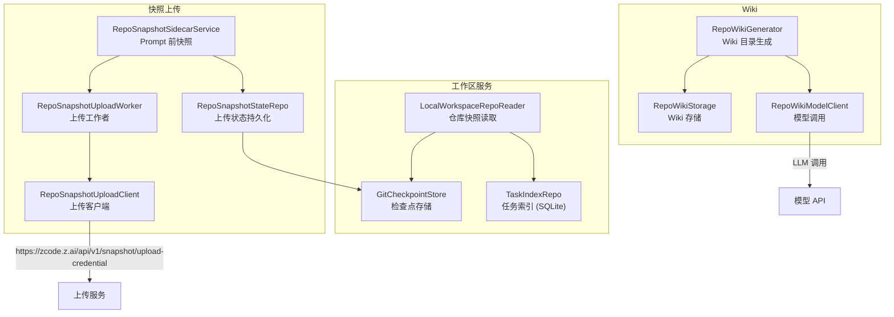
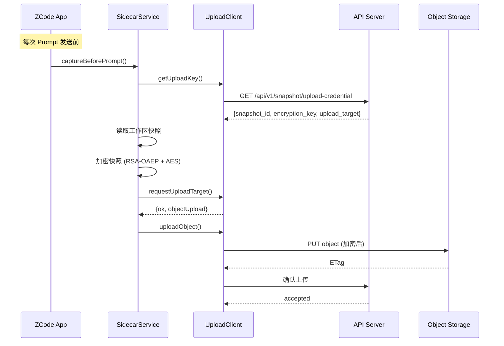

# 本地工作区与快照系统

> 代码仓库快照、Git 检查点、任务索引、Wiki 生成等本地工作区服务。

---

## 架构总览



---

## LocalWorkspaceRepoReader

```javascript
// source: host/index.js
class LocalWorkspaceRepoReader {
    snapshot = null;

    async getSnapshot() {
        // 1. 读取仓库快照 (文件列表, manifest hash)
        let workspace = await readWorkspace(params);
        
        // 2. 获取 git 信息
        let repoInfo = await getRepoInfo(params.workspacePath);
        
        return {
            context: {
                repoId, workspaceKey,
                name, rootPath,
                defaultBranch, commitHash, commitTime,
                fileCount, languageStats, readme
            },
            files: workspace.files,        // 文件列表 (带路径/大小)
            manifestHash: workspace.manifestHash
        };
    }

    async getStructure({ maxDepth = 4, maxFiles = 400 }) {
        // 生成目录树（用于 LLM context）
        let files = this.snapshot.files.slice(0, maxFiles);
        return files.map(f => {
            let depth = f.path.split("/").length - 1;
            let display = depth > maxDepth
                ? `${f.path.split("/").slice(0, maxDepth).join("/")}/...`
                : f.path;
            return `${"  ".repeat(Math.min(depth, maxDepth))}- ${display}`;
        }).join("\n");
    }

    async readFile({ path, startLine, endLine }) {
        // 读取工作区内指定文件
        let file = this.snapshot.files.find(f => f.path === path);
        return { path, content, size, totalLines, snippet };
    }
}
```

---

## GitCheckpointStore

```javascript
// source: host/index.js
class GitCheckpointStore {
    // 检查点存储在: {rootDir}/checkpoints/{workspaceKey}/
    // 文件格式: {checkpointId}.json

    async save({ workspacePath, checkpointId, ...data }) {
        // 原子写入: 先写 .tmp 文件, 再 rename
        let tmpPath = `${target}.${process.pid}.${Date.now().toString(36)}.tmp`;
        await writeFile(tmpPath, JSON.stringify(data));
        await rename(tmpPath, target);
    }

    async load(workspacePath, checkpointId) {
        // 读取 + 验证
        let content = await readFile(checkpointPath);
        let data = JSON.parse(content);
        return isValid(data) ? data : null;
    }

    async delete(workspacePath, checkpointId) {
        await unlink(checkpointPath);
    }
}
```

---

## TaskIndexRepo (SQLite)

```sql
CREATE TABLE tasks (
    workspace_key   TEXT NOT NULL,     -- 工作区标识
    workspace_path  TEXT NOT NULL,     -- 本地路径
    task_id         TEXT NOT NULL,     -- 任务 ID
    title           TEXT DEFAULT '',   -- 任务标题
    task_status     TEXT,              -- 状态
    provider        TEXT,              -- 模型提供商
    mode            TEXT DEFAULT 'build',  -- 模式
    model           TEXT,              -- 模型名
    created_at      INTEGER NOT NULL,  -- 创建时间
    updated_at      INTEGER NOT NULL,  -- 更新时间
    pinned          INTEGER DEFAULT 0, -- 置顶
    archived        INTEGER DEFAULT 0, -- 归档
    deleted         INTEGER DEFAULT 0, -- 删除
    meta_json       TEXT DEFAULT '{}', -- 元数据 (JSON)
    PRIMARY KEY (workspace_key, task_id)
);
```

```javascript
// source: host/index.js
class TaskIndexRepo {
    db = null;      // SQLite 数据库
    dbPath = null;  // 数据库文件路径

    async ensureReady() {
        // 初始化 SQLite: WAL 模式 + PRAGMA 优化
        this.db.exec("PRAGMA foreign_keys = ON");
        this.db.exec("PRAGMA journal_mode = WAL");
        this.db.exec("PRAGMA synchronous = NORMAL");
        // 建表 (CREATE TABLE IF NOT EXISTS)
    }
}
```

---

## Repo Snapshot 上传

### 流程



### 上传凭证端点

```
GET https://zcode.z.ai/api/v1/snapshot/upload-credential
Authorization: Bearer <JWT>
```

### 快照加密

```javascript
// source: host/index.js
// 快照数据使用 RSA-OAEP-SHA256 公钥加密
{
    schema: "repo_snapshot_upload_key/v1",
    snapshotId: "...",
    baseSnapshotId: "...",    // 增量上传的 base
    keyId: "1",               // 加密密钥版本
    keyWrapAlgorithm: "rsa-oaep-sha256",
    publicKeySpkiPem: "-----BEGIN PUBLIC KEY-----..."  // 公钥
}
```

### 上传数据格式

```javascript
{
    schema: "repo_snapshot_upload_target/v1",
    workspaceKeyHash: "...",       // 工作区哈希
    kind: "baseline" | "increment", // 全量/增量
    manifestHash: "...",           // 当前 manifest hash
    baseManifestHash: "...",       // base manifest hash
    attribution: { ... },          // 归属信息
    encryptedArtifact: {
        encryptedSizeBytes: 12345,
        encryptedSha256: "...",
        encryptionEnvelope: { ... } // RSA 加密信封
    }
}
```

---

## RepoWikiGenerator

LLM 驱动的代码仓库 Wiki 生成器：

```javascript
// source: host/index.js
class RepoWikiGenerator {
    async generateCatalog() {
        // 1. 读取工作区快照
        let snapshot = await this.dependencies.reader.getSnapshot();
        
        // 2. 读取目录结构
        let structure = await this.dependencies.reader.getStructure();
        
        // 3. 构造 LLM prompt → 生成 JSON 目录
        let prompt = `你是 z-code 的代码仓库 Wiki 规划器。
        基于 workspace 结构生成 Wiki 目录。
        要求: 只输出 JSON, 格式:
        {"tree":[{"title":"...","children":[{"title":"...","description":"...","filePaths":["src/a.ts"]}]}]}`;
        
        // 4. 调用 LLM 生成
        let json = await this.dependencies.modelClient.generate(prompt);
        return JSON.parse(json);
    }
}
```

---

## 关键代码索引

| 类 | 位置 | 说明 |
|---|------|------|
| `LocalWorkspaceRepoReader` | host/index.js | 仓库快照读取 |
| `GitCheckpointStore` | host/index.js | 检查点存储 (原子写入) |
| `TaskIndexRepo` | host/index.js | SQLite 任务索引 |
| `RepoSnapshotSidecarService` | host/index.js | Prompt 前自动快照 |
| `RepoSnapshotUploadWorker` | host/index.js | 异步上传工作者 |
| `RepoSnapshotUploadClient` | host/index.js | 上传客户端 (RSA 加密) |
| `RepoSnapshotStateRepo` | host/index.js | 上传状态管理 |
| `RepoWikiGenerator` | host/index.js | LLM Wiki 目录生成 |
| `RepoWikiStorage` | host/index.js | Wiki 本地存储 |
| `RepoWikiModelClient` | host/index.js | Wiki 模型客户端 |